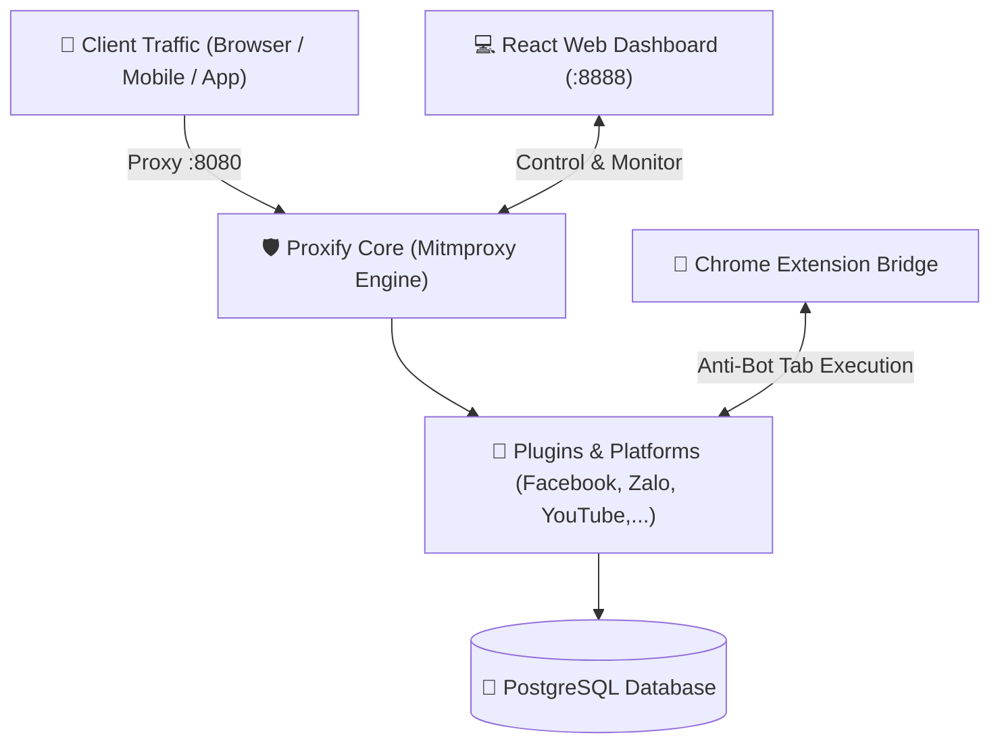

<h1 align="center">
    <br>
    
    <br>
    Proxify
    <br>
    <small>The Ultimate Multi-Platform Request Capture & Reverse-Engineering Framework</small>
</h1>

<p align="center">
    <strong>English</strong> | <a href="README_vi.md">Tiếng Việt</a>
</p>

<p align="center">
    <a href="https://python.org" alt="Python version">
        </a>
    <a href="https://mitmproxy.org/" alt="Mitmproxy">
        </a>
    <a href="https://react.dev/" alt="React">
        </a>
    <a href="https://postgresql.org" alt="PostgreSQL">
        </a>
    <a href="#" alt="License">
        </a>
</p>

<p align="center">
    <a href="#overview"><strong>Overview</strong></a>
    &middot;
    <a href="#core-features"><strong>Core Features</strong></a>
    &middot;
    <a href="#platforms"><strong>Platforms & Plugins</strong></a>
    &middot;
    <a href="#quick-start"><strong>Quick Start</strong></a>
    &middot;
    <a href="#architecture"><strong>Architecture</strong></a>
    &middot;
    <a href="#structure"><strong>Directory Structure</strong></a>
</p>

---

## 🌟 Overview

**Proxify** is a comprehensive framework engineered for **traffic interception, reverse-engineering, and automated data extraction** across HTTP, HTTPS, HTTP/2, and WebSocket protocols.

Built on the industrial-grade **Mitmproxy 10** engine, Proxify seamlessly unites:
1. **Multi-Threaded Proxy Core**: Silent interception, HTTPS TLS decryption, and high-throughput raw traffic ingestion into PostgreSQL.
2. **Anti-Bot & WAF Bypass Engine**: Intelligent detection and evasion of modern bot protections (Cloudflare Turnstile, Facebook Checkpoint, Akamai) via TLS/JA3 impersonation and a Chrome Extension First-Party Tab Bridge.
3. **Pluggable Multi-Platform Architecture**: Out-of-the-box support for **Facebook**, **Zalo**, and **YouTube**, alongside a dynamic plugin system ready to scale to TikTok, Shopee, Telegram, and beyond.
4. **Interactive Real-Time Dashboard**: A modern React-powered UI featuring a Live Traffic Inspector (akin to Fiddler/Charles/Burp Suite), platform-specific management consoles, session persistence, and crawling controllers.

---

## 🛡️ Core Features

### 1. Stealth MITM Interception & Decryption
- **Full HTTPS/TLS Decryption**: Generates and manages trusted CA root certificates to decrypt encrypted traffic across desktop browsers, mobile apps (Android/iOS), and emulators.
- **HTTP/2 & WebSocket Streaming**: Native handling of multiplexed HTTP/2 frames and persistent WebSocket duplex streams (e.g., Zalo chat sockets, Facebook Lightspeed).
- **Asynchronous Traffic Storage**: Offloads raw requests/responses to an asynchronous PostgreSQL pipeline (`TrafficStorageWorker`) with zero latency impact on live browsing.
- **Clean Logging Engine**: Employs `PollingEndpointFilter` to silence routine `200 OK` polling noise, delivering a tranquil, high-signal console.

### 2. Anti-Bot Bypass & Stealth Suite
- **Soft-Block Detection (`stealth.py`)**: Automatically detects Cloudflare challenge pages, CAPTCHAs, and 429/503 rate-limit states to trigger intelligent exponential backoff.
- **Chrome Extension First-Party Tab Bridge**: Executes requests directly within the user's authentic Facebook/site browser tab, fully inheriting real cookies, local IP, and browser context to **eliminate 1357001 logout errors**.
- **Circuit Breaker Resilience**: Prevents cascading failures and server bans by auto-throttling requests when upstream targets show distress.

### 3. Hot-Pluggable Dynamic Plugin System
- Follows the **Open/Closed Principle**: Extend Proxify to any new service simply by subclassing `BasePlugin` and adding the `@register_plugin("name")` decorator.
- Lifecycle hooks available: `on_request()`, `on_response()`, `on_websocket_message()`, and `on_error()`.

---

## 🌐 Supported Platforms & Plugins

### 📘 1. Facebook Platform (`platforms/facebook/`)
- **Decoupled Feed & Comment Engine (50x Faster)**: Super-fast chronological feed scraping (~1.5s/page) decoupled from deep comment extraction.
- **Automatic Unfiltered Comments**: Automatically enforces `CHRONOLOGICAL_UNFILTERED_INTENT_V1` to capture 100% of all comments without manual UI toggles.
- **Bi-Directional Relay Pagination**: Comprehensive handling of both `before` and `after` cursors up to 500 pages (~5,000 comments/post).
- **Live Start / Stop Toggle Controls**: Immediate cancellation of background comment scraping tasks.
- **Facebook Dashboard Console**: Group selector, author filters, full-text search, and multi-level comment hierarchy viewer.

### 💬 2. Zalo Platform (`platforms/zalo/` & `plugins/zalo.py`)
- **Protocol & Crypto Decryption**: Uses an embedded JavaScript runtime (`crypto_subtle.js`) to decrypt end-to-end encrypted packets and WebSocket messages from Zalo Web.
- **Message & Contact Extractor**: Automatically parses chat messages, group memberships, and contact books into structured PostgreSQL tables (`database.py`, `models.py`, `repository.py`).
- **Dedicated Zalo Web UI**: Independent interface (`zalo.html`, `zalo.js`) for inspecting decrypted Zalo messages and contacts in real-time.

### 🎥 3. YouTube Plugin (`plugins/youtube.py` & `utils/youtube_utils.py`)
- **Ad-Stripping Engine**: Automatically identifies and strips video/audio advertising segments from streaming payloads (`strip_youtube_ads`).
- **Stream URL Interceptor**: Extracts direct media streaming URLs for background playback and offline storage.

### 🔌 4. TLS Spoofer Plugin (`plugins/tls_spoofer.py`)
- Impersonates standard Google Chrome TLS ClientHello configurations and Cipher Suites, disguising proxy connections from JA3 fingerprint monitors.

---

## 🚀 Quick Start

### Method 1: Docker Compose (Recommended)

Start the entire stack (Backend Proxy + PostgreSQL + React UI) with a single command:

```bash
# 1. Clone the repository
git clone https://github.com/tmph2003/Proxify.git
cd Proxify

# 2. Launch all services
docker compose up -d
```

Access your environment:
- **Web Dashboard (React UI):** `http://localhost:8888`
- **Proxy Server (Mitmproxy):** `http://localhost:8080`
- **PostgreSQL Database:** Port `5432`

> 💡 **One-Time SSL Certificate Setup:**  
> Route your browser/device traffic through `127.0.0.1:8080`, then visit `http://mitm.it` in your browser to install the Mitmproxy Root CA certificate.

---

### Method 2: Manual Development Mode

```bash
# 1. Install Python requirements
pip install -r requirements.txt

# 2. Configure environment
cp .env.example .env

# 3. Start Proxy Backend
python -m proxify

# 4. Start React Frontend (in a separate terminal)
cd frontend
npm install
npm run dev
```

---

## 📂 Architecture Overview



---

## 📂 Directory Structure

```text
Proxify/
├── backend/
│   ├── chrome_extension/        # Browser Extension Bridge (Service Worker & Content Script)
│   ├── proxify/
│   │   ├── core/                # System orchestration
│   │   │   ├── router.py        # Fast Proxy Router
│   │   │   ├── traffic_storage/ # Asynchronous raw traffic persistence
│   │   │   └── worker.py        # Normalization background worker
│   │   ├── platforms/           # Specialized platform engines
│   │   │   ├── facebook/        # Facebook (Crawler, Bridge, Auth, Extractor, API)
│   │   │   └── zalo/            # Zalo (Crypto Decryption, Models, Extractor, DB)
│   │   ├── plugins/             # Dynamic drop-in plugins
│   │   │   ├── registry.py      # Plugin Registry & Auto-Discovery
│   │   │   ├── facebook.py      # Facebook Traffic Adapter
│   │   │   ├── zalo.py          # Zalo Traffic Adapter
│   │   │   ├── youtube.py       # YouTube Ad-Stripper & Stream Interceptor
│   │   │   └── tls_spoofer.py   # TLS ClientHello / JA3 Spoofer
│   │   ├── utils/               # Shared utilities
│   │   │   ├── stealth.py       # Soft-block detection & WAF bypass
│   │   │   ├── circuit_breaker.py # Circuit breaker resilience
│   │   │   ├── youtube_utils.py # Media stream extraction & ad removal
│   │   │   └── graphql.py       # GraphQL AST parser
│   │   ├── server.py            # Mitmproxy DumpMaster & Clean Logging setup
│   │   └── dashboard.py         # Internal metrics dashboard
│   └── tests/                   # Pytest test suite
├── frontend/                    # Modern React Web Dashboard (React + Vite + TypeScript)
│   ├── src/                     # UI components, state hooks, traffic viewers
│   └── nginx.conf               # Nginx production web server configuration
├── docs/                        # Architecture documentation & AI Developer Changelog
└── docker-compose.yml           # Multi-container orchestration (App, UI, Database)
```

---

## 📜 License

This project is licensed under the **MIT License**. Contributions, issues, and feature requests are welcome!
