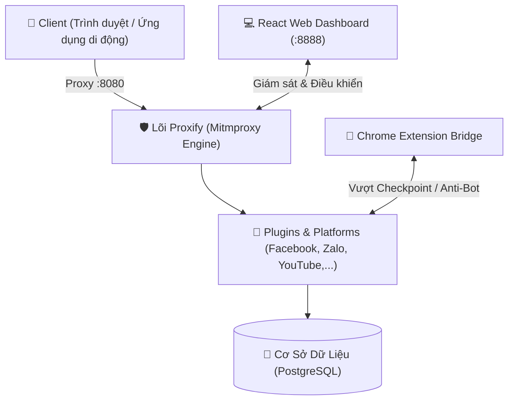

<h1 align="center">
    <br>
    
    <br>
    Proxify
    <br>
    <small>The Ultimate Multi-Platform Request Capture & Reverse-Engineering Framework</small>
</h1>

<p align="center">
    <a href="README.md">English</a> | <strong>Tiếng Việt</strong>
</p>

<p align="center">
    <a href="https://python.org" alt="Python version">
        </a>
    <a href="https://mitmproxy.org/" alt="Mitmproxy">
        </a>
    <a href="https://react.dev/" alt="React">
        </a>
    <a href="https://postgresql.org" alt="PostgreSQL">
        </a>
    <a href="#" alt="License">
        </a>
</p>

<p align="center">
    <a href="#overview"><strong>Tổng quan</strong></a>
    &middot;
    <a href="#core-features"><strong>Tính năng cốt lõi</strong></a>
    &middot;
    <a href="#platforms"><strong>Nền tảng & Plugin</strong></a>
    &middot;
    <a href="#quick-start"><strong>Bắt đầu nhanh</strong></a>
    &middot;
    <a href="#architecture"><strong>Kiến trúc hệ thống</strong></a>
    &middot;
    <a href="#structure"><strong>Cấu trúc thư mục</strong></a>
</p>

---

## 🌟 Tổng Quan (Overview)

**Proxify** là một nền tảng framework toàn diện chuyên dùng để **đánh chặn (interception), phân tích giải mã (reverse-engineering), và tự động trích xuất dữ liệu (data extraction)** từ các luồng traffic HTTP/HTTPS/HTTP2/WebSocket.

Được xây dựng trên nền tảng **Mitmproxy 10**, Proxify kết hợp giữa:
1. **Lõi Proxy Đa Luồng (Mitmproxy Core)**: Đánh chặn tàng hình, giải mã TLS, tự động lưu trữ luồng dữ liệu thô vào PostgreSQL.
2. **Cơ Chế Bỏ Qua Anti-Bot (Stealth & TLS Spoofing)**: Nhận diện và vượt qua các cơ chế WAF/Anti-Bot khắt khe (Cloudflare, Facebook Checkpoint, Akamai) thông qua giả lập TLS/JA3 Fingerprint và Chrome Extension First-Party Tab Bridge.
3. **Hệ Thống Plugin & Nền Tảng Đa Dạng**: Tích hợp sẵn bộ trích xuất dữ liệu chuyên sâu cho **Facebook**, **Zalo**, **YouTube**, cùng kiến trúc plugin mở dễ dàng mở rộng cho TikTok, Shopee, Telegram,...
4. **Dashboard Quản Trị Trực Quan**: Theo dõi traffic thời gian thực (Live Traffic Inspector tương tự Fiddler/Charles), quản lý phiên, cấu hình proxy và điều khiển cào dữ liệu qua giao diện Web React hiện đại.

---

## 🛡️ Tính Năng Cốt Lõi (Core Features)

### 1. Đánh Chặn & Giải Mã Traffic Tàng Hình (Stealth MITM)
- **Giải mã HTTPS/TLS**: Tự động cài đặt CA Certificate để bóc tách toàn bộ gói tin mã hóa SSL/TLS trên trình duyệt, ứng dụng di động (Android/iOS) và giả lập.
- **Hỗ trợ HTTP/2 & WebSocket**: Bắt trọn vẹn các luồng dữ liệu thời gian thực (như Zalo Chat WebSocket, Facebook Lightspeed/StreamController).
- **Lưu trữ Traffic Bất đồng bộ (Async Traffic Storage)**: Toàn bộ Request và Response thô được đẩy vào hàng đợi và xử lý bởi `TrafficStorageWorker` lưu vào PostgreSQL mà không gây bất kỳ độ trễ nào cho kết nối mạng của người dùng.
- **Bộ Lọc Log Thông Minh (Clean Logging)**: Tích hợp `PollingEndpointFilter` loại bỏ 100% rác log polling nội bộ `200 OK`, chỉ hiển thị các sự kiện nghiệp vụ và cảnh báo thực sự quan trọng.

### 2. Bộ Công Cụ Vượt Rào Cản Anti-Bot (Stealth Engine)
- **Phát hiện Soft-Block tự động (`stealth.py`)**: Tự động nhận diện các trang thử thách Cloudflare Turnstile, CAPTCHA, Facebook Checkpoint redirect và mã lỗi 429/503 để kích hoạt Exponential Backoff.
- **Chrome Extension First-Party Tab Bridge**: Thực thi request ngầm ngay trong tab trình duyệt thật của người dùng, kế thừa trọn vẹn phiên đăng nhập, Cookie và IP nội địa, **triệt tiêu hoàn toàn lỗi Checkpoint/Logout 1357001**.
- **Circuit Breaker Pattern**: Bảo vệ hệ thống khỏi việc gửi dồn dập request khi máy chủ đích đang bị nghẽn hoặc tạm khóa.

### 3. Kiến Trúc Plugin Cắm Nóng (Dynamic Plugin System)
- Thiết kế theo nguyên tắc **Open/Closed**: Mọi nền tảng mới chỉ cần kế thừa `BasePlugin` và đăng ký qua `@register_plugin("name")`.
- Tự động hook vào các vòng đời gói tin: `on_request()`, `on_response()`, `on_websocket_message()`, `on_error()`.

---

## 🌐 Các Nền Tảng Hỗ Trợ Sẵn (Supported Platforms & Plugins)

### 📘 1. Facebook Platform (`platforms/facebook/`)
- **Tách Rời Feed & Comment ($50\times$ Speedup)**: Cào danh sách bài viết nhóm theo thứ tự thời gian (`CHRONOLOGICAL`) siêu tốc (~1.5s/trang), tách biệt hoàn toàn với tiến trình cào bình luận.
- **Tự Động Thu Thập "Tất Cả Bình Luận"**: Cưỡng chế `CHRONOLOGICAL_UNFILTERED_INTENT_V1` để lấy sạch 100% bình luận (kể cả bình luận bị Facebook xếp vào spam hoặc ẩn).
- **Phân Trang 2 Chiều (Bi-Directional Relay Pagination)**: Hỗ trợ đồng thời cả `before` và `after` cursor, nâng giới hạn lên đến 500 trang (~5,000 bình luận/bài viết).
- **Điều Khiển Bắt Đầu / Dừng Cào Tức Thì**: Nút bấm dừng cào linh hoạt kèm hủy bỏ tác vụ nền ngay lập tức.
- **Giao Diện Facebook Dashboard**: Quản lý phiên, lọc theo tác giả, ngày tháng, tìm kiếm full-text và modal xem chi tiết bình luận đa cấp.

### 💬 2. Zalo Platform (`platforms/zalo/` & `plugins/zalo.py`)
- **Giải Mã Giao Thức Zalo**: Sử dụng engine JavaScript nhúng (`crypto_subtle.js`) để giải mã các gói tin mã hóa đầu cuối (E2EE) và dữ liệu WebSocket của Zalo Web.
- **Bóc Tách Tin Nhắn & Hội Thoại**: Tự động trích xuất cấu trúc tin nhắn, hội thoại cá nhân, danh bạ bạn bè và thông tin thành viên nhóm Zalo (`database.py`, `models.py`, `repository.py`).
- **Giao Diện Zalo Riêng Biệt**: Template giao diện độc lập (`zalo.html`, `zalo.js`) phục vụ việc theo dõi tin nhắn và danh bạ trực tiếp.

### 🎥 3. YouTube Plugin (`plugins/youtube.py` & `utils/youtube_utils.py`)
- **Lọc & Loại Bỏ Quảng Cáo (Ad-Stripping)**: Tự động phát hiện và loại bỏ các đoạn quảng cáo chèn trong luồng dữ liệu video/audio của YouTube (`strip_youtube_ads`).
- **Bắt Luồng Video/Audio Stream**: Bóc tách các URL streaming media trực tiếp, hỗ trợ việc tải về hoặc phát nền không giới hạn.

### 🔌 4. TLS Spoofer Plugin (`plugins/tls_spoofer.py`)
- Giả lập vân tay TLS ClientHello và bộ mã hóa Cipher Suites chuẩn của Google Chrome trên Windows/macOS, che giấu dấu vết proxy đối với các hệ thống WAF giám sát JA3.

---

## 🚀 Bắt Đầu Nhanh (Quick Start)

### Cách 1: Chạy Bằng Docker Compose (Khuyên Dùng)

Khởi chạy trọn bộ 3 dịch vụ chỉ với một câu lệnh:

```bash
# 1. Clone mã nguồn
git clone https://github.com/tmph2003/Proxify.git
cd Proxify

# 2. Khởi chạy toàn bộ hệ thống
docker compose up -d
```

Các dịch vụ sẽ sẵn sàng tại:
- **Web Dashboard (React UI):** `http://localhost:8888`
- **Proxy Server (Mitmproxy):** `http://localhost:8080`
- **PostgreSQL Database:** Cổng `5432`

> 💡 **Cài đặt chứng chỉ SSL/TLS (Chỉ làm 1 lần duy nhất):**  
> Cấu hình máy của bạn trỏ Proxy về `127.0.0.1:8080`, sau đó truy cập `http://mitm.it` trên trình duyệt để tải và cài đặt chứng chỉ Root CA vào máy.

---

### Cách 2: Chạy Thủ Công (Development Mode)

```bash
# 1. Cài đặt thư viện Python
pip install -r requirements.txt

# 2. Cấu hình biến môi trường
cp .env.example .env

# 3. Khởi chạy Backend Proxy
python -m proxify

# 4. Khởi chạy Frontend UI (Thư mục frontend/)
cd frontend
npm install
npm run dev
```

---

## 📂 Kiến Trúc Hệ Thống (Architecture)



---

## 📂 Cấu Trúc Thư Mục (Directory Structure)

```text
Proxify/
├── backend/
│   ├── chrome_extension/        # Chrome Extension Bridge (Background Service Worker & Content Script)
│   ├── proxify/
│   │   ├── core/                # Lõi điều phối hệ thống
│   │   │   ├── router.py        # Fast Proxy Router phân luồng
│   │   │   ├── traffic_storage/ # Worker lưu trữ traffic thô bất đồng bộ
│   │   │   └── worker.py        # Background Normalization Worker
│   │   ├── platforms/           # Bộ trích xuất nghiệp vụ chuyên sâu theo nền tảng
│   │   │   ├── facebook/        # Facebook Engine (Crawler, Bridge, Auth, Extractor, API)
│   │   │   └── zalo/            # Zalo Engine (Crypto Decryption, Models, Extractor, Database)
│   │   ├── plugins/             # Các Plugin cắm nóng mở rộng
│   │   │   ├── registry.py      # Plugin Registry & Auto-Discovery
│   │   │   ├── facebook.py      # Facebook Traffic Adapter
│   │   │   ├── zalo.py          # Zalo Traffic Adapter
│   │   │   ├── youtube.py       # YouTube Ad-Stripper & Stream Interceptor
│   │   │   └── tls_spoofer.py   # TLS JA3 ClientHello Spoofer
│   │   ├── utils/               # Công cụ bổ trợ
│   │   │   ├── stealth.py       # Nhận diện Soft-block, CAPTCHA, WAF Bypass
│   │   │   ├── circuit_breaker.py # Cơ chế tự ngắt mạch chống sập
│   │   │   ├── youtube_utils.py # Hàm bóc tách luồng & strip quảng cáo
│   │   │   └── graphql.py       # Parser AST truy vấn GraphQL
│   │   ├── server.py            # Mitmproxy DumpMaster & Clean Logging setup
│   │   └── dashboard.py         # Metrics & Internal Dashboard
│   └── tests/                   # Bộ kiểm thử tự động pytest
├── frontend/                    # Giao diện Web hiện đại (React + TypeScript + Vite)
│   ├── src/                     # Mã nguồn UI (Facebook Console, Traffic Viewer, Hooks)
│   └── nginx.conf               # Nginx server cấu hình cho Docker
├── docs/                        # Toàn bộ tài liệu kiến trúc & AI Developer Logs
└── docker-compose.yml           # Khởi chạy đa dịch vụ (App, UI, Database)
```

---

## 📜 Giấy Phép (License)

Dự án được phân phối dưới giấy phép **MIT License**. Mọi đóng góp, báo lỗi (Issue) và Pull Request đều được chào đón!
