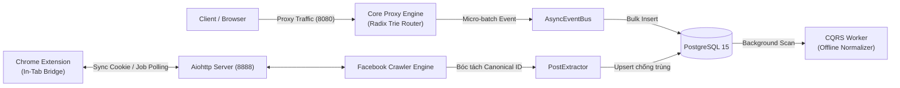

# CẨM NANG KIẾN TRÚC & MÃ NGUỒN CHI TIẾT DỰ ÁN PROXIFY (MASTER INDEX)

> **Tác giả:** Antigravity AI Engineering Team  
> **Cập nhật:** 2026-09-03  
> **Phiên bản:** Proxify v2.0 Architecture Deep-Dive (Modular Edition)  
> **Mục tiêu:** Cung cấp bản đồ điều hướng tổng thể cho toàn bộ mã nguồn hệ thống Proxify. Để tối ưu tốc độ đọc và tra cứu theo từng chuyên đề, cẩm nang đã được phân tách thành 5 module chuyên sâu độc lập.

---

## 🗺️ BẢN ĐỒ ĐIỀU HƯỚNG CÁC MODULE (MODULAR GUIDES)

Vui lòng chọn từng tài liệu chuyên đề chi tiết dưới đây:

| Module | Tệp hướng dẫn | Trọng tâm kỹ thuật & Danh sách file chi tiết |
| :--- | :--- | :--- |
| **Module 1** | [📘 **01_core_proxy.md**](./codebase_guide/01_core_proxy.md) | **Lõi hệ thống, Proxy Pipeline & Xử lý bất đồng bộ**<br>• `server.py`: Điểm khởi chạy chung một Event Loop.<br>• `core/router.py`: Cây tiền tố Radix Trie Router $O(\text{depth})$.<br>• `core/eventbus.py`: Message Broker Micro-batching & Load Shedding.<br>• `core/worker.py`: Background Worker CQRS chuẩn hóa ngầm.<br>• `dashboard.py`: Aiohttp WebSocket & Export Engine.<br>• `storage/__init__.py`: Connection Pool Psycopg2. |
| **Module 2** | [🛡️ **02_stealth_tls.md**](./codebase_guide/02_stealth_tls.md) | **Động cơ tàng hình & Vượt tường lửa WAF**<br>• `utils/stealth.py`: StealthSessionManager, Chrome 120 TLS fingerprint.<br>• `plugins/tls_spoofer.py`: Plugin giả lập TLS vượt Akamai/ByteDance.<br>• Nhận diện Soft Block & Exponential Backoff with Full Jitter. |
| **Module 3** | [🌐 **03_facebook_platform.md**](./codebase_guide/03_facebook_platform.md) | **Subsystem thu thập Facebook chuyên sâu**<br>• `platforms/facebook/bridge.py`: Extension Bridge In-Tab.<br>• `platforms/facebook/crawler.py`: Dual-Engine Crawler (Extension & Docker).<br>• `platforms/facebook/extractor.py`: Bóc tách Canonical Post ID chống trùng lặp.<br>• `platforms/facebook/repository.py`: PostRepository `ON CONFLICT DO UPDATE GREATEST`.<br>• `platforms/facebook/token_store.py`: Quản lý đệm phiên & template.<br>• `platforms/facebook/api.py`: Facebook REST API Controller. |
| **Module 4** | [🧩 **04_chrome_extension.md**](./codebase_guide/04_chrome_extension.md) | **Chrome Extension (Proxify Bridge Extension)**<br>• `background.js`: Service Worker In-Tab execution trong MAIN World.<br>• `popup.js`: Quét cookie đa miền (hỗ trợ CHIPS) & sync 1-chạm.<br>• `content.js`: Heartbeat 10s duy trì Service Worker chống sleep. |
| **Module 5** | [⚡ **05_plugins_and_extensions.md**](./codebase_guide/05_plugins_and_extensions.md) | **Các Plugin mở rộng & Tổng kết kiến trúc**<br>• `plugins/youtube.py`: Chặn quảng cáo & tự động tua skip ad.<br>• `platforms/zalo/`: Hook giải mã Crypto Subtle Zalo Web.<br>• Sơ đồ toàn cảnh liên kết các tầng hệ thống. |

---

## 🏛️ KIẾN TRÚC TOÀN TRÌNH HỆ THỐNG PROXIFY

### 1. Sơ đồ tương tác đa thành phần:
```
                  ┌───────────────────────────────┐
                  │    Chrome Extension (v3)      │
                  │   - background.js (In-Tab)    │
                  │   - popup.js (CHIPS Cookie)   │
                  │   - content.js (Keep-Alive)   │
                  └──────────────┬────────────────┘
                                 │ HTTP REST (Jobs & Results)
                                 ▼
┌─────────────────────────────────────────────────────────────────┐
│                     aiohttp API (Cổng 8888)                     │
│  ┌─────────────────────────┐       ┌─────────────────────────┐  │
│  │     ExtensionBridge     │◄──────┤     FacebookCrawler     │  │
│  └─────────────────────────┘       └────────────┬────────────┘  │
│                                                 │               │
│                                                 ▼               │
│  ┌─────────────────────────┐       ┌─────────────────────────┐  │
│  │      PostRepository     │◄──────┤      PostExtractor      │  │
│  │   (ON CONFLICT DO UPD)  │       │   (Canonical Post ID)   │  │
│  └────────────┬────────────┘       └─────────────────────────┘  │
└───────────────┼─────────────────────────────────────────────────┘
                │
                ▼ SQL Insert/Upsert
┌─────────────────────────────────────────────────────────────────┐
│                    PostgreSQL 15 (Cổng 5432)                    │
│   Schema core:     raw_payloads, requests                       │
│   Schema facebook: posts, comments, groups                      │
│   Schema zalo:     members, groups                              │
└─────────────────────────────────────────────────────────────────┘
```

### 2. Sơ đồ luồng dữ liệu tổng hợp (End-to-End Pipeline):


---

## 🔍 BẢNG TRA CỨU NHANH FILE NGUỒN $\rightarrow$ TÀI LIỆU HƯỚNG DẪN

Khi cần tìm hiểu một file nguồn cụ thể, hãy xem bảng đối chiếu dưới đây:

| File nguồn trong Codebase | Module chứa tài liệu giải thích |
| :--- | :--- |
| `backend/proxify/server.py` | [Module 1: Phần 1.1](./codebase_guide/01_core_proxy.md#11-backendproxifyserverpy) |
| `backend/proxify/core/router.py` | [Module 1: Phần 1.2](./codebase_guide/01_core_proxy.md#12-backendproxifycorerouterpy) |
| `backend/proxify/core/eventbus.py` | [Module 1: Phần 1.3](./codebase_guide/01_core_proxy.md#13-backendproxifycoreeventbuspy) |
| `backend/proxify/core/worker.py` | [Module 1: Phần 1.4](./codebase_guide/01_core_proxy.md#14-backendproxifycoreworkerpy) |
| `backend/proxify/core/traffic_storage/` | [Module 1: Phần 1.6](./codebase_guide/01_core_proxy.md#16-backendproxifycoretraffic_storage) |
| `backend/proxify/utils/stealth.py` | [Module 2: Phần 2.1](./codebase_guide/02_stealth_tls.md#21-backendproxifyutilsstealthpy) |
| `backend/proxify/plugins/tls_spoofer.py` | [Module 2: Phần 2.2](./codebase_guide/02_stealth_tls.md#22-backendproxifypluginstls_spooferpy) |
| `backend/proxify/platforms/facebook/bridge.py` | [Module 3: Phần 3.1](./codebase_guide/03_facebook_platform.md#31-backendproxifyplatformsfacebookbridgepy) |
| `backend/proxify/platforms/facebook/crawler.py` | [Module 3: Phần 3.2](./codebase_guide/03_facebook_platform.md#32-backendproxifyplatformsfacebookcrawlerpy) |
| `backend/proxify/platforms/facebook/extractor.py` | [Module 3: Phần 3.3](./codebase_guide/03_facebook_platform.md#33-backendproxifyplatformsfacebookextractorpy) |
| `backend/proxify/platforms/facebook/database.py` *(Gộp Repository)* | [Module 3: Phần 3.4](./codebase_guide/03_facebook_platform.md#34-backendproxifyplatformsfacebookdatabasepy) |
| `backend/proxify/platforms/facebook/stealth.py` *(Gộp Delay + Session + Network)* | [Module 3: Phần 3.5](./codebase_guide/03_facebook_platform.md#35-backendproxifyplatformsfacebookstealthpy) |
| `backend/proxify/platforms/facebook/workflow.py` *(Gộp Commands + Observer + Queue)* | [Module 3: Phần 3.6](./codebase_guide/03_facebook_platform.md#36-backendproxifyplatformsfacebookworkflowpy) |
| `backend/proxify/platforms/facebook/auth.py` *(Gộp TokenStore + AuthFetcher)* | [Module 3: Phần 3.7](./codebase_guide/03_facebook_platform.md#37-backendproxifyplatformsfacebookauthpy) |
| `backend/proxify/platforms/facebook/api.py` | [Module 3: Phần 3.8](./codebase_guide/03_facebook_platform.md#38-backendproxifyplatformsfacebookapipy) |
| `backend/proxify/platforms/facebook/interceptor.py` | [Module 3: Phần 3.9](./codebase_guide/03_facebook_platform.md#39-backendproxifyplatformsfacebookinterceptorpy) |
| `backend/proxify/platforms/facebook/platform.py` | [Module 3: Phần 3.10](./codebase_guide/03_facebook_platform.md#310-backendproxifyplatformsfacebookplatformpy) |
| `backend/proxify/platforms/facebook/template_fetcher.py` | [Module 3: Phần 3.11](./codebase_guide/03_facebook_platform.md#311-backendproxifyplatformsfacebooktemplate_fetcherpy) |
| `backend/chrome_extension/background.js` | [Module 4: Phần 4.1](./codebase_guide/04_chrome_extension.md#41-backendchrome_extensionbackgroundjs) |
| `backend/chrome_extension/popup.js` | [Module 4: Phần 4.2](./codebase_guide/04_chrome_extension.md#42-backendchrome_extensionpopupjs) |
| `backend/chrome_extension/content.js` | [Module 4: Phần 4.3](./codebase_guide/04_chrome_extension.md#43-backendchrome_extensioncontentjs) |
| `backend/proxify/plugins/youtube.py` | [Module 5: Phần 5.1](./codebase_guide/05_plugins_and_extensions.md#51-backendproxifypluginsyoutubepy) |
| `backend/proxify/platforms/zalo/` | [Module 5: Phần 5.2](./codebase_guide/05_plugins_and_extensions.md#52-backendproxifyplatformszalo) |

---
*Tài liệu này được biên soạn và chuẩn hóa bởi Antigravity AI, giúp việc tìm kiếm và duy trì tài liệu dự án Proxify luôn khoa học, nhanh chóng.*
