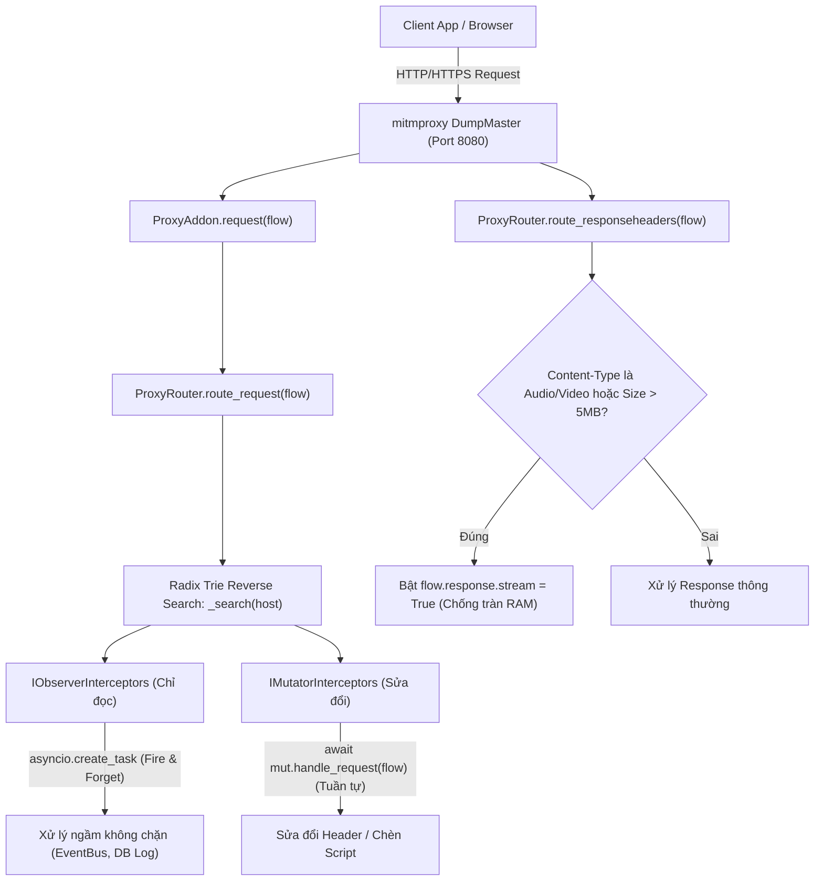
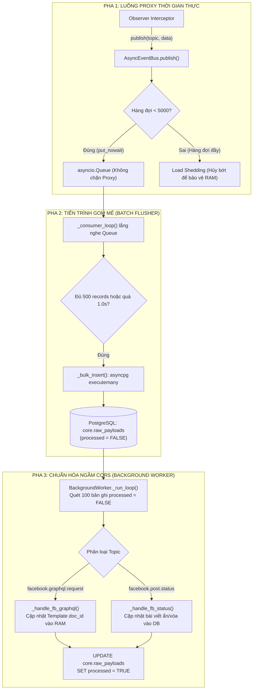

# MODULE 1: LÕI HỆ THỐNG VÀ ĐIỀU HƯỚNG (CORE PROXY & SERVER PIPELINE)

> [!NOTE]
> Thuộc bộ cẩm nang chi tiết mã nguồn Proxify v2.0 Architecture Deep-Dive.  
> [⬅️ Quay lại Cẩm nang tổng quan](../CODEBASE_DETAILED_GUIDE.md) | [Tiến tới Module 2: Động Cơ Tàng Hình ➡️](./02_stealth_tls.md)

---

## MỤC LỤC MODULE 1
- [1.1. `backend/proxify/server.py` (Điểm khởi động hệ thống)](#11-backendproxifyserverpy)
  - [Class `ProxyAddon`](#class-proxyaddon)
  - [Class `V1GlobalObserver`](#class-v1globalobserver)
  - [Hàm `start_dashboard`](#hàm-async-def-start_dashboardstorage-api_routes-port8888)
  - [Hàm `run_server`](#hàm-async-def-run_server)
- [1.2. `backend/proxify/core/router.py` (Cây tiền tố Radix Trie Router)](#12-backendproxifycorerouterpy)
  - [Class `TrieNode`](#class-trienode)
  - [Class `ProxyRouter`](#class-proxyrouter)
  - [📊 Lưu đồ 1: Điều Phối Gói Tin & Phân Luồng Định Tuyến](#-lưu-đồ-1-điều-phối-gói-tin--phân-luồng-định-tuyến-routing--interceptor-pipeline)
- [1.3. `backend/proxify/core/eventbus.py` (Message Broker AsyncEventBus)](#13-backendproxifycoreeventbuspy)
  - [Class `AsyncEventBus`](#class-asynceventbus)
- [1.4. `backend/proxify/core/worker.py` (Background Worker chuẩn hóa ngầm CQRS)](#14-backendproxifycoreworkerpy)
  - [Class `BackgroundWorker`](#class-backgroundworker)
  - [📊 Lưu đồ 2: Xử Lý Bất Đồng Bộ EventBus & Chuẩn Hóa Ngầm CQRS](#-lưu-đồ-2-xử-lý-bất-đồng-bộ-eventbus--chuẩn-hóa-ngầm-cqrs)
- [1.5. `backend/proxify/dashboard.py` (Aiohttp API & WebSocket Server)](#15-backendproxifydashboardpy)
  - [Class `Dashboard`](#class-dashboard)
- [1.6. `backend/proxify/core/traffic_storage/` (Bộ đệm lưu trữ gói tin mạng Mitmproxy)](#16-backendproxifycoretraffic_storage)
  - [Class `RequestStorage`](#class-requeststorage)

---

<a id="11-backendproxifyserverpy"></a>
## 1.1. `backend/proxify/server.py`
Tệp khởi tạo chính (Entry Point) của toàn bộ hệ thống backend Proxify. File này chịu trách nhiệm tích hợp công cụ bắt gói tin `mitmproxy` và web server `aiohttp` chạy chung trên **cùng một Asyncio Event Loop duy nhất**.

---

### Class `ProxyAddon`
Addon của mitmproxy ủy quyền xử lý các gói tin cho `ProxyRouter`.
* **`__init__(self, router: ProxyRouter)`**:
  * *Tham số:* `router` (thể hiện của `ProxyRouter`).
  * *Ý nghĩa:* Lưu trữ tham chiếu tới router để phân phối sự kiện mạng.
* **`async def request(self, flow: http.HTTPFlow)`**:
  * *Tham số:* `flow` (gói tin HTTP request gửi từ client đến proxy).
  * *Logic:* Gọi `await self.router.route_request(flow)`.
* **`async def responseheaders(self, flow: http.HTTPFlow)`**:
  * *Tham số:* `flow` (gói tin HTTP khi headers vừa từ máy chủ đích trả về).
  * *Logic:* Gọi `await self.router.route_responseheaders(flow)`. Được sử dụng để bật cơ chế streaming chống tràn RAM đối với tệp media lớn.
* **`async def response(self, flow: http.HTTPFlow)`**:
  * *Tham số:* `flow` (gói tin HTTP đã nhận xong toàn bộ body).
  * *Logic:* Gọi `await self.router.route_response(flow)`.

---

### Class `V1GlobalObserver`
Cầu nối tương thích ngược (Backward Compatibility) giữa kiến trúc v2 và bảng điều khiển v1.
* **`__init__(self, broadcast_fn, storage)`**:
  * *Tham số:* `broadcast_fn` (hàm gửi tin WebSocket ra Dashboard), `storage` (đối tượng `RequestStorage`).
  * *Logic:* Khởi tạo hai listener `DashboardBroadcaster` và `DatabaseWriter`.
* **`async def handle_response(self, flow)`**:
  * *Logic:* Kiểm tra xem cờ `db_integration_enabled` có bật không và domain có nằm trong danh sách `db_allowed_domains` không. Sau đó gọi `self.broadcaster` để đẩy dữ liệu lên UI và `self.db_writer` để lưu vào PostgreSQL.

---

### Hàm `async def start_dashboard(storage, api_routes, port=8888)`
* **Mục đích:** Khởi động Aiohttp Web Server phục vụ Dashboard và các REST API.
* **Tham số:**
  * `storage`: Kho dữ liệu v1 `RequestStorage`.
  * `api_routes`: Danh sách các endpoint REST API từ các module (Facebook, Zalo).
  * `port`: Cổng lắng nghe (mặc định 8888).
* **Giá trị trả về:** Tuple `(runner, dashboard)` để có thể gọi `cleanup()` khi tắt server.
* **Logic:** Tạo đối tượng `Dashboard`, đăng ký `api_routes`, thiết lập `AppRunner` và `TCPSite` chạy trên `0.0.0.0`.

---

### Hàm `async def run_server()`
* **Mục đích:** Hàm điều phối cao nhất khởi chạy toàn bộ các dịch vụ trên một event loop.
* **Logic chi tiết từng bước:**
  1. Đọc biến môi trường `DB_DSN` và kết nối pool PostgreSQL qua `DatabaseManager`.
  2. Khởi chạy `AsyncEventBus` và `BackgroundWorker` chạy nền.
  3. Khởi tạo `ProxyRouter`, nạp `FacebookPlatform` và đăng ký các Interceptors (Observers/Mutators).
  4. Cấu hình `mitmproxy.options.Options(listen_port=8080, ssl_insecure=True, http2=False)` và gắn `ProxyAddon`, `StealthUpstreamAddon`, `YouTubePlugin`.
  5. Khởi động `start_dashboard` trên cổng 8888.
  6. Khởi tạo các bảng cơ sở dữ liệu Facebook (`fb_db.init_db`) và Zalo (`zalo_db.init_db`) trong thread phụ qua `asyncio.to_thread`.
  7. Chạy `await master.run()` để mitmproxy đón nhận lưu lượng mạng.
  8. Trong khối `finally:`, đóng kết nối tuần tự theo thứ tự: `storage.close()` $\rightarrow$ `worker.stop()` $\rightarrow$ `event_bus.stop()` $\rightarrow$ `db_manager.disconnect()` $\rightarrow$ `runner.cleanup()`.

---

<a id="12-backendproxifycorerouterpy"></a>
## 1.2. `backend/proxify/core/router.py`
Bộ định tuyến hiệu năng cao cho Proxy, sử dụng cấu trúc dữ liệu cây tiền tố đảo ngược (Reverse Domain Radix Trie) để tìm kiếm Interceptor khớp với domain của gói tin trong thời gian $O(\text{depth})$.

---

### Class `TrieNode`
* **Thuộc tính:**
  * `children: Dict[str, TrieNode]`: Bảng ánh xạ các phần của domain.
  * `observers: List[IObserverInterceptor]`: Danh sách Interceptor chỉ đọc gắn tại node này.
  * `mutators: List[IMutatorInterceptor]`: Danh sách Interceptor can thiệp sửa đổi gói tin tại node này.

---

### Class `ProxyRouter`
* **`__init__(self)`**: Khởi tạo `self.root = TrieNode()`, danh sách `global_observers` và `global_mutators` (chạy cho mọi domain).
* **`_insert(self, domain: str, interceptor, is_mutator: bool)`**:
  * *Tham số:* `domain` (chuỗi domain như `api.facebook.com`), `interceptor`, `is_mutator` (True nếu là mutator, False nếu là observer).
  * *Logic:* Tách domain theo dấu chấm, đảo ngược danh sách (ví dụ: `api.facebook.com` $\rightarrow$ `['com', 'facebook', 'api']`), duyệt từ gốc và tạo `TrieNode` con nếu chưa có, sau đó gắn interceptor vào node cuối cùng.
  * *Lý do đảo ngược:* Giúp match tự nhiên từ TLD vào subdomain (ví dụ node `.facebook.com` sẽ tự động khớp mọi subdomain `api.facebook.com`, `graph.facebook.com`).
* **`register_observer(self, observer)`**: Nếu `observer.target_domains` rỗng, đưa vào `global_observers`; ngược lại chèn vào cây Trie qua `_insert`.
* **`register_mutator(self, mutator)`**: Tương tự, đăng ký mutator vào `global_mutators` hoặc cây Trie.
* **`_search(self, domain: str) -> Tuple[List[IObserverInterceptor], List[IMutatorInterceptor]]`**:
  * *Tham số:* `domain` (ví dụ `web.facebook.com`).
  * *Trả về:* Tuple chứa danh sách observer và mutator khớp từ gốc đến ngọn.
  * *Độ phức tạp:* $O(\text{depth})$, với depth thường $\le 4$, nhanh hơn gấp nhiều lần so với duyệt regex tuần tự khi có hàng trăm plugin.
* **`async def route_request(self, flow: http.HTTPFlow)`**:
  * *Logic:*
    1. Tìm các interceptor khớp với `flow.request.pretty_host`.
    2. Đối với **Observers**: Đẩy vào `asyncio.create_task(obs.handle_request(flow))` chạy ngầm bất đồng bộ (Fire-and-forget), không làm tăng độ trễ mạng của người dùng.
    3. Đối với **Mutators**: Thực thi tuần tự `await mut.handle_request(flow)` để bảo đảm thứ tự thay đổi header hoặc body trước khi gửi đi.
* **`async def route_responseheaders(self, flow: http.HTTPFlow)`**:
  * *Bảo vệ tràn bộ nhớ (OOM Protection):* Nếu `content-type` chứa `video/` hoặc `audio/`, hoặc `content-length > 5MB`, tự động bật `flow.response.stream = True` để mitmproxy truyền dữ liệu dạng luồng trực tiếp, không đệm toàn bộ file video/nhạc vào RAM.

---

<a id="diagram-1"></a>
### 📊 Lưu đồ 1: Điều Phối Gói Tin & Phân Luồng Định Tuyến (Routing & Interceptor Pipeline)

#### 1. Sơ đồ dạng khối trực quan (Sắc nét, dễ nhìn trên mọi màn hình):
```
┌─────────────────────────────────────────────────────────────────────────────────┐
│                      LUỒNG BẮT VÀ ĐIỀU PHỐI GÓI TIN PROXY                       │
│                                                                                 │
│   Client (Trình duyệt)                                                          │
│        │ HTTP/HTTPS Request                                                     │
│        ▼                                                                        │
│   mitmproxy (Port 8080) ──► ProxyAddon.request() ──► ProxyRouter.route_request()│
│                                                            │                    │
│                                                            ▼ Tra cứu Radix Trie │
│                                                   _search(domain)               │
│                                                    /            \               │
│                                                   /              \              │
│                                                  ▼                ▼             │
│                                      IObserverInterceptors    IMutatorInterceptors
│                                         (Chỉ đọc data)         (Sửa đổi gói tin)│
│                                                │                        │       │
│                                                ▼                        ▼       │
│                                       asyncio.create_task()     await xử lý     │
│                                       (Chạy ngầm, không chặn)   (Chạy tuần tự)  │
│                                                │                        │       │
│                                                ▼                        ▼       │
│                                            EventBus / DB         Gửi ra Server  │
└─────────────────────────────────────────────────────────────────────────────────┘
```

#### 2. Sơ đồ luồng Mermaid phân tầng từ trên xuống (Dạng dọc TD):


---

<a id="13-backendproxifycoreeventbuspy"></a>
## 1.3. `backend/proxify/core/eventbus.py`
Message Broker nội bộ bất đồng bộ, tách rời luồng bắt gói tin thời gian thực của Proxy khỏi các tác vụ ghi cơ sở dữ liệu nặng nề thông qua cơ chế vi mẻ (Micro-batching) và kiểm soát áp lực ngược (Backpressure).

---

### Class `AsyncEventBus`
* **`__init__(self, db_pool, max_queue_size=5000, batch_size=500, flush_interval=1.0)`**:
  * *Thuộc tính:*
    * `queue`: `asyncio.Queue` có kích thước giới hạn `max_queue_size=5000`.
    * `batch_size`: Số lượng sự kiện tối đa gom lại trước khi ghi một lần vào DB (500 sự kiện).
    * `flush_interval`: Thời gian tối đa (1 giây) ép xả mẻ ra DB nếu chưa đủ 500 sự kiện.
* **`def publish(self, topic: str, data: dict)`**:
  * *Tham số:* `topic` (tên chủ đề ví dụ `facebook.graphql.request`), `data` (dictionary dữ liệu).
  * *Logic:* Đóng gói `{"topic": topic, "data": data, "timestamp": time.time()}` và đưa vào hàng đợi bằng `self.queue.put_nowait(event)`.
  * *Cơ chế Backpressure (Load Shedding):* Nếu hàng đợi bị đầy (`QueueFull`), hàm bắt ngoại lệ và chủ động bỏ qua sự kiện kèm cảnh báo critical. Việc này ngăn chặn nguy cơ Proxy bị treo hoặc máy chủ bị sập vì hết RAM (OOM) khi lưu lượng tăng đột biến.
* **`async def _consumer_loop(self)`**:
  * *Logic:* Vòng lặp chạy ngầm liên tục chờ sự kiện từ `queue`. Sử dụng `asyncio.wait_for(..., timeout=flush_interval)`. Khi đủ `batch_size` hoặc hết thời gian chờ, gọi `await self._bulk_insert(batch)` và xóa mẻ.
* **`async def _bulk_insert(self, batch: List[Dict[str, Any]])`**:
  * *Logic:* Chuẩn bị danh sách bản ghi `(topic, json_data, timestamp)` và gọi `conn.executemany("INSERT INTO core.raw_payloads ...")` trên connection pool của `asyncpg`. Ghi đồng loạt 500 bản ghi chỉ trong một lượt truy vấn mạng (network roundtrip).

---

<a id="14-backendproxifycoreworkerpy"></a>
## 1.4. `backend/proxify/core/worker.py`
Worker xử lý ngầm (Offline Normalizer) hoạt động theo mô hình CQRS. Worker quét các bản ghi chưa xử lý trong bảng `core.raw_payloads` và phân tích dữ liệu chuyên sâu mà không làm ảnh hưởng đến tốc độ mạng của người dùng.

---

### Class `BackgroundWorker`
* **`async def _process_batch(self)`**:
  * *Logic:* Lấy tối đa 100 bản ghi có `processed = FALSE` từ bảng `core.raw_payloads`, phân loại theo `topic`:
    * Nếu topic là `facebook.graphql.request`: Gọi `_handle_fb_graphql(payload)` để lưu mẫu template GraphQL.
    * Nếu topic là `facebook.post.status`: Gọi `_handle_fb_status(conn, payload)` để cập nhật trạng thái bài viết bị ẩn/xóa.
  * Đánh dấu các ID đã xử lý bằng câu lệnh `UPDATE core.raw_payloads SET processed = TRUE WHERE id = ANY($1)`.
* **`async def _handle_fb_graphql(self, payload: dict)`**:
  * *Tham số:* `payload` chứa thông tin request headers và form_data bắt được từ proxy.
  * *Logic:* Kiểm tra `friendly_name` của GraphQL. Nếu là `GroupsCometFeed...`, cập nhật vào `IN_MEMORY_TEMPLATES["feed"]`; nếu là bình luận/trả lời, cập nhật vào `comment`/`reply`. Giúp hệ thống luôn tự động cập nhật doc_id và cấu trúc form_data mới nhất khi người dùng lướt Facebook thật.
* **`async def _handle_fb_status(self, conn, payload: dict)`**:
  * *Tham số:* `conn` (kết nối asyncpg), `payload` (chứa `path` và `is_active`).
  * *Logic:* Thực thi câu lệnh `UPDATE facebook.posts SET is_active = $1 WHERE permalink_url LIKE $2` để cập nhật trạng thái bài viết đã bị Facebook xóa hoặc ẩn.

---

<a id="diagram-2"></a>
### 📊 Lưu đồ 2: Xử Lý Bất Đồng Bộ EventBus & Chuẩn Hóa Ngầm CQRS

#### 1. Sơ đồ dạng khối trực quan (Sắc nét, phông chữ lớn, dễ nhìn trên mọi màn hình):
```
┌─────────────────────────────────────────────────────────────────────────────────┐
│                      PHA 1: LUỒNG PROXY THỜI GIAN THỰC                          │
│                                                                                 │
│   Observer Interceptor ──► publish(topic, data) ──► AsyncEventBus.publish()     │
│                                                            │                    │
│                                                            ▼                    │
│                                                [ Hàng đợi < 5000? ]             │
│                                                /                  \             │
│                                   (Đúng)      /                    \ (Hàng đầy) │
│                                              ▼                      ▼           │
│                                    asyncio.Queue               Load Shedding    │
│                                 (put_nowait không chặn)      (Bỏ qua để cứu RAM)│
└──────────────────────────────────────────────┬──────────────────────────────────┘
                                               │
                                               ▼ Đọc dữ liệu
┌─────────────────────────────────────────────────────────────────────────────────┐
│                      PHA 2: TIẾN TRÌNH GOM MẺ (BATCH FLUSHER)                   │
│                                                                                 │
│   _consumer_loop() ──► Gom mẻ [ Đủ 500 records HOẶC hết 1.0 giây timeout ]      │
│                               │                                                 │
│                               ▼                                                 │
│   _bulk_insert()   ──► asyncpg conn.executemany(...)                            │
│                               │                                                 │
│                               ▼ Ghi đồng loạt 1 truy vấn                        │
│   PostgreSQL       ──► Bảng: core.raw_payloads (processed = FALSE)             │
└──────────────────────────────────────────────┬──────────────────────────────────┘
                                               │
                                               ▼ Quét ngầm mỗi 2s
┌─────────────────────────────────────────────────────────────────────────────────┐
│                      PHA 3: CHUẨN HÓA NGẦM CQRS (BACKGROUND WORKER)             │
│                                                                                 │
│   _run_loop()      ──► SELECT * FROM core.raw_payloads LIMIT 100                │
│                               │                                                 │
│                               ▼ Phân loại Topic                                 │
│        ┌──────────────────────┴──────────────────────┐                          │
│        ▼ (facebook.graphql.request)                  ▼ (facebook.post.status)   │
│   _handle_fb_graphql()                          _handle_fb_status()             │
│   (Cập nhật template doc_id vào RAM)            (Cập nhật bài viết bị ẩn/xóa)   │
│        │                                             │                          │
│        └──────────────────────┬──────────────────────┘                          │
│                               ▼                                                 │
│   Hoàn tất         ──► UPDATE core.raw_payloads SET processed = TRUE            │
└─────────────────────────────────────────────────────────────────────────────────┘
```

#### 2. Sơ đồ luồng Mermaid phân tầng từ trên xuống (Dạng dọc TD - không bị co nhỏ):


---

<a id="15-backendproxifydashboardpy"></a>
## 1.5. `backend/proxify/dashboard.py`
Cung cấp toàn bộ hệ thống API phục vụ giao diện Dashboard giám sát lưu lượng mạng, xuất dữ liệu và tương tác WebSocket hai chiều.

---

### Class `Dashboard`
* **`__init__(self, storage: RequestStorage, host="0.0.0.0", port=8888)`**:
  * Thiết lập ứng dụng aiohttp web application, danh sách client WebSocket `self.websockets: Set[web.WebSocketResponse]`.
* **`async def broadcast(self, data: dict, msg_type="new_request")`**:
  * *Tham số:* `data` (thông tin tóm tắt request/response), `msg_type` (loại thông điệp).
  * *Logic:* Đóng gói JSON `{"type": msg_type, "data": data}` và gửi đồng thời tới toàn bộ các trình duyệt đang mở Dashboard thông qua WebSocket. Nếu kết nối nào bị đứt, tự động loại bỏ khỏi tập hợp.
* **`async def _handle_websocket(self, request: web.Request) -> web.WebSocketResponse`**:
  * *Logic:* Nâng cấp HTTP request lên kết nối WebSocket (`web.WebSocketResponse`), lắng nghe thông điệp `ping` và gửi `pong` để duy trì kết nối.
* **`async def _handle_list_requests(self, request: web.Request)`**:
  * *Logic:* Nhận các query params (`limit`, `offset`, `domain`, `status`, `search`, `since`) và gọi `storage.query_requests` để trả về danh sách lịch sử gói tin kèm phân trang.
* **`async def _handle_export(self, request: web.Request)`**:
  * *Logic:* Hỗ trợ xuất dữ liệu lưu lượng mạng theo 3 định dạng:
    * `format=har`: Xuất file chuẩn HTTP Archive (HAR 1.2) để import vào Wireshark/Chrome DevTools.
    * `format=json`: Xuất mảng JSON đầy đủ request & response headers/body.
    * `format=csv`: Xuất bảng tính CSV chứa các cột cơ bản.
* **`async def _handle_stealth_verify(self, request: web.Request)`**:
  * *Logic:* Sử dụng `StealthSessionManager` gửi request tới `https://tls.browserleaks.com/json` hoặc `https://httpbin.org/headers` để kiểm tra chữ ký JA3 và sự sạch sẽ của headers, trả về điểm số phát hiện bot cho Dashboard.

---

<a id="16-backendproxifycoretraffic_storage"></a>
## 1.6. `backend/proxify/core/traffic_storage/`
Tầng chuyên trách lưu trữ lưu lượng mạng HTTP/HTTPS của Mitmproxy. Bao gồm `RequestStorage` Facade, `RequestRepository` quản lý bảng `public.requests`, và các worker chạy nền `AsyncWriterWorker`, `TTLWorker` để batch-commit và tự động dọn rác log theo TTL. Giao tiếp với PostgreSQL thông qua shared connection pool (`proxify.database.pool`).

---

### Class `RequestStorage`
* **`def __init__(self, db_dsn: str)`**:
  * Khởi tạo `ThreadedConnectionPool(minconn=2, maxconn=10)`. Đọc cấu hình lọc domain từ bảng `core.config`.
* **`def _prepare_request_data(self, data: dict) -> tuple`**:
  * *Mục đích:* Chuẩn hóa dữ liệu thô từ Mitmproxy trước khi ghi DB: cắt ngắn URL quá dài, giải mã gzip/deflate/br cho response body, lọc bỏ các chuỗi nhị phân không in được.
* **`def save_request(self, data: dict) -> int`**:
  * *Logic:* Lấy kết nối từ pool, thực thi lệnh `INSERT INTO core.requests ... RETURNING id`, commit transaction và trả về `id` bản ghi vừa chèn.
* **`def save_request_async(self, data: dict, callback=None)`**:
  * *Logic:* Sử dụng `ThreadPoolExecutor` để chạy hàm `save_request` ở thread phụ, trả lại luồng chính ngay lập tức.
* **`def query_requests(self, limit, offset, domain, search, ...)`**:
  * *Logic:* Xây dựng câu lệnh SQL động với các mệnh đề `WHERE` tùy biến theo bộ lọc của người dùng trên giao diện.

---

> [!TIP]
> [⬅️ Quay lại Cẩm nang tổng quan](../CODEBASE_DETAILED_GUIDE.md) | [Tiến tới Module 2: Động Cơ Tàng Hình ➡️](./02_stealth_tls.md)
