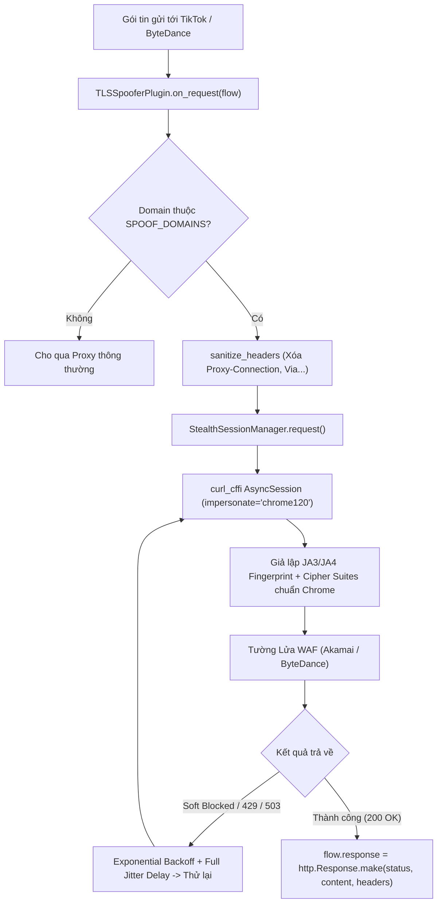

# MODULE 2: ĐỘNG CƠ TÀNG HÌNH & GIẢ LẬP TLS (STEALTH & TLS SPOOFER)

> [!NOTE]
> Thuộc bộ cẩm nang chi tiết mã nguồn Proxify v2.0 Architecture Deep-Dive.  
> [⬅️ Quay lại Module 1: Lõi Hệ Thống](./01_core_proxy.md) | [Quay lại Cẩm nang tổng quan](../CODEBASE_DETAILED_GUIDE.md) | [Tiến tới Module 3: Nền Tảng Facebook ➡️](./03_facebook_platform.md)

---

## MỤC LỤC MODULE 2
- [2.1. `backend/proxify/utils/stealth.py` (StealthSessionManager & curl_cffi)](#21-backendproxifyutilsstealthpy)
  - [Hàm `sanitize_headers`](#hàm-def-sanitize_headersraw_headers-dict---dict)
  - [Hàm `is_soft_blocked`](#hàm-def-is_soft_blockedstatus_code-int-content-bytes-headers-dict-url-str---bool)
  - [Class `StealthSessionManager`](#class-stealthsessionmanager)
- [2.2. `backend/proxify/plugins/tls_spoofer.py` (Plugin vượt tường lửa Akamai/ByteDance)](#22-backendproxifypluginstls_spooferpy)
- [📊 Lưu đồ 3: Động Cơ Tàng Hình & Giả Lập TLS Vượt Tường Lửa (Stealth & WAF Bypass)](#-lưu-đồ-3-động-cơ-tàng-hình--giả-lập-tls-vượt-tường-lửa-stealth--waf-bypass)

---

<a id="21-backendproxifyutilsstealthpy"></a>
## 2.1. `backend/proxify/utils/stealth.py`
Bộ công cụ cốt lõi giả lập phiên kết nối bảo mật cấp thấp thông qua thư viện `curl_cffi`, sao chép chính xác chữ ký mã hóa của Google Chrome.

---

### Hàm `def sanitize_headers(raw_headers: dict) -> dict`
* **Mục đích:** Loại bỏ toàn bộ các dấu vết của Proxy trước khi gửi ra Internet.
* **Logic:** Loại bỏ các header cấm như `proxy-connection`, `x-forwarded-for`, `x-real-ip`, `via`, `forwarded`, `transfer-encoding`. Chuyển đổi toàn bộ tên header về chữ thường (lowercase) để chuẩn hóa theo chuẩn HTTP/2.

---

### Hàm `def is_soft_blocked(status_code: int, content: bytes, headers: dict, url: str) -> bool`
* **Mục đích:** Nhận diện các hình thức chặn mềm (Soft Block / Challenge) mà máy chủ không trả về mã 403/401 thông thường.
* **Logic:**
  * Bắt các mã HTTP 429 (Rate Limit), 503 (Cloudflare Under Attack).
  * Quét nội dung HTML tìm các từ khóa nhận dạng trang chặn: `"cf-browser-verification"`, `"challenge-running"`, `"checking your browser"`, `"bot detection"`, `"vui lòng xác minh"`.
  * Trả về `True` nếu phát hiện bị chặn, giúp hệ thống kích hoạt cơ chế backoff và đổi IP/User-Agent.

---

### Class `StealthSessionManager`
* **`def __init__(self, impersonate="chrome120", max_retries=3, base_delay=1.0)`**:
  * Cấu hình phiên `curl_cffi` giả lập Chrome phiên bản 120 (bao gồm cipher suites, TLS extensions, supported curves, HTTP/2 SETTINGS frames).
* **`async def request(self, method, url, **kwargs) -> StealthResponse`**:
  * *Logic:*
    1. Làm sạch headers bằng `sanitize_headers`.
    2. Thực hiện yêu cầu qua `curl_cffi.requests.AsyncSession(impersonate=self.impersonate)`.
    3. Nếu gặp lỗi kết nối hoặc bị soft-blocked, tự động áp dụng công thức Exponential Backoff with Full Jitter:
       $$\text{Delay} = \text{random}(0, \text{base\_delay} \times 2^{\text{attempt}})$$
    4. Thử lại tối đa `max_retries` lần.
* **`async def verify_fingerprint(self) -> dict`**:
  * Gửi request thử nghiệm đến `https://tls.browserleaks.com/json` và trả về kết quả gồm: mã băm `ja3_hash`, `ja4`, phiên bản HTTP/2 hỗ trợ.

---

<a id="22-backendproxifypluginstls_spooferpy"></a>
## 2.2. `backend/proxify/plugins/tls_spoofer.py`
Plugin can thiệp lưu lượng ở tầng proxy dành riêng cho các nền tảng áp dụng WAF kiểm tra chữ ký TLS gắt gao (như TikTok, ByteDance).

* **`async def on_request(self, flow)`**:
  * *Logic:*
    1. Kiểm tra xem domain của request có nằm trong cấu hình `SPOOF_DOMAINS` (ví dụ `tiktok.com`) hay không.
    2. Nếu có, trích xuất Method, Headers, URL và Body của gói tin.
    3. Loại bỏ header nhạy cảm của proxy.
    4. Gửi lại request bằng `StealthSessionManager` với TLS Chrome thật.
    5. Khi nhận được response từ máy chủ đích, ghi đè trực tiếp kết quả vào `flow.response = http.Response.make(...)`. Máy chủ đích hoàn toàn tin tưởng đây là trình duyệt Chrome thật gửi lệnh.

---

<a id="diagram-3"></a>
### 📊 Lưu đồ 3: Động Cơ Tàng Hình & Giả Lập TLS Vượt Tường Lửa (Stealth & WAF Bypass)

#### 1. Sơ đồ dạng khối trực quan (Sắc nét, dễ nhìn trên mọi màn hình):
```
┌─────────────────────────────────────────────────────────────────────────────────┐
│                    LUỒNG GIẢ LẬP TLS VƯỢT TƯỜNG LỬA (WAF BYPASS)                │
│                                                                                 │
│   Gói tin gửi tới TikTok / ByteDance                                            │
│        │                                                                        │
│        ▼                                                                        │
│   TLSSpooferPlugin.on_request() ──► [ Domain thuộc SPOOF_DOMAINS? ]             │
│                                       /                  \                      │
│                          (Không)     /                    \ (Có)                │
│                                     ▼                      ▼                    │
│                            Cho qua Proxy          sanitize_headers()            │
│                            thông thường           (Xóa Proxy-Connection, Via)   │
│                                                            │                    │
│                                                            ▼                    │
│                                                   StealthSessionManager         │
│                                                   (curl_cffi chrome120)         │
│                                                            │                    │
│                                                            ▼ Bắt tay TLS        │
│                                                   Chữ ký JA3/JA4 Chrome Thật   │
│                                                            │                    │
│                                                            ▼ Gửi trực tiếp      │
│                                                   Tường Lửa WAF (Akamai/Byte)   │
│                                                            │                    │
│                                                            ▼ Trả về Client      │
│                                                   flow.response = make(...)     │
└─────────────────────────────────────────────────────────────────────────────────┘
```

#### 2. Sơ đồ luồng Mermaid phân tầng từ trên xuống (Dạng dọc TD):


---

> [!TIP]
> [⬅️ Quay lại Module 1: Lõi Hệ Thống](./01_core_proxy.md) | [Quay lại Cẩm nang tổng quan](../CODEBASE_DETAILED_GUIDE.md) | [Tiến tới Module 3: Nền Tảng Facebook ➡️](./03_facebook_platform.md)
