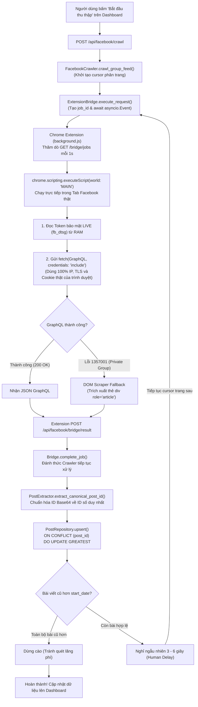

# MODULE 3: HỆ THỐNG THU THẬP FACEBOOK (FACEBOOK PLATFORM)

> [!NOTE]
> Thuộc bộ cẩm nang chi tiết mã nguồn Proxify v2.0 Architecture Deep-Dive.  
> [⬅️ Quay lại Module 2: Động Cơ Tàng Hình](./02_stealth_tls.md) | [Quay lại Cẩm nang tổng quan](../CODEBASE_DETAILED_GUIDE.md) | [Tiến tới Module 4: Chrome Extension ➡️](./04_chrome_extension.md)

---

## MỤC LỤC MODULE 3
- [3.1. `backend/proxify/platforms/facebook/bridge.py` (Cầu nối Extension Bridge)](#31-backendproxifyplatformsfacebookbridgepy)
- [3.2. `backend/proxify/platforms/facebook/crawler.py` (Động cơ cào dữ liệu FacebookCrawler)](#32-backendproxifyplatformsfacebookcrawlerpy)
- [3.3. `backend/proxify/platforms/facebook/extractor.py` (Bóc tách & Chuẩn hóa Canonical Post ID)](#33-backendproxifyplatformsfacebookextractorpy)
- [3.4. `backend/proxify/platforms/facebook/database.py` (Hợp nhất CSDL PostgreSQL & Repositories)](#34-backendproxifyplatformsfacebookdatabasepy)
- [3.5. `backend/proxify/platforms/facebook/stealth.py` (Hợp nhất Delay, Session State, Borg Rate Limiter)](#35-backendproxifyplatformsfacebookstealthpy)
- [3.6. `backend/proxify/platforms/facebook/workflow.py` (Hợp nhất Commands, Observer State, SQLite Task Queue & DLQ)](#36-backendproxifyplatformsfacebookworkflowpy)
- [3.7. `backend/proxify/platforms/facebook/auth.py` (Hợp nhất In-Memory Token Store & Checkpoint Verifier)](#37-backendproxifyplatformsfacebookauthpy)
- [3.8. `backend/proxify/platforms/facebook/api.py` (Bộ điều khiển REST API Facebook)](#38-backendproxifyplatformsfacebookapipy)
- [3.9. `backend/proxify/platforms/facebook/interceptor.py` (Bắt gói tin thụ động & Phát hiện bài viết die)](#39-backendproxifyplatformsfacebookinterceptorpy)
- [3.10. `backend/proxify/platforms/facebook/platform.py` (Plugin Slice kết nối lõi Proxify)](#310-backendproxifyplatformsfacebookplatformpy)
- [3.11. `backend/proxify/platforms/facebook/template_fetcher.py` (Playwright GraphQL Template Sniffer)](#311-backendproxifyplatformsfacebooktemplate_fetcherpy)
- [📊 Lưu đồ 4: Toàn Trình Thu Thập Facebook In-Tab Execution (Full Crawl Lifecycle)](#-lưu-đồ-4-toàn-trình-thu-thập-facebook-in-tab-execution-full-crawl-lifecycle)

---

<a id="31-backendproxifyplatformsfacebookbridgepy"></a>
## 3.1. `backend/proxify/platforms/facebook/bridge.py`
Trái tim của kiến trúc **In-Tab Execution**. Tệp này cung cấp cầu nối điều phối công việc giữa Backend Docker và Chrome Extension chạy trên máy thật.

---

### Class `ExtensionBridge`
* **Thuộc tính:**
  * `pending_jobs: Dict[str, dict]`: Hàng đợi các job cào đang chờ Extension lấy về.
  * `results: Dict[str, Any]`: Bộ lưu trữ kết quả trả về từ Extension theo `job_id`.
  * `events: Dict[str, asyncio.Event]`: Các Asyncio Event dùng để đánh thức coroutine đang chờ kết quả.
  * `last_poll_time: float`: Mốc thời gian gần nhất Extension gửi request hỏi job (dùng làm heartbeat).
* **`def is_connected(self, threshold=60.0) -> bool`**:
  * *Logic:* Kiểm tra `(time.time() - self.last_poll_time) < threshold`. Nếu Extension đã không poll trong hơn 60 giây, kết luận Extension đã mất kết nối.
* **`def get_job(self) -> Optional[dict]`**:
  * *Logic:* Cập nhật `self.last_poll_time = time.time()`. Lấy và xóa job cũ nhất trong hàng đợi `pending_jobs` để trả về cho Extension.
* **`async def execute_request(self, url, method="POST", headers=None, data=None, timeout=30) -> dict`**:
  * *Mục đích:* Gửi một lệnh cào xuống Extension và tạm dừng hàm (await) cho đến khi Extension thực thi xong trong tab trình duyệt và trả kết quả về.
  * *Logic:*
    1. Tạo mã duy nhất `job_id = str(uuid.uuid4())`.
    2. Lọc bỏ các header cấm của Fetch API (`cookie`, `user-agent`, `host`, `referer`) vì trình duyệt sẽ tự sinh các header này theo ngữ cảnh thật.
    3. Trích xuất URL nhóm mục tiêu từ Referer và đóng gói vào `job`.
    4. Khởi tạo `self.events[job_id] = asyncio.Event()`.
    5. Đợi kết quả với `asyncio.wait_for(self.events[job_id].wait(), timeout=timeout)`.
    6. Trả về dữ liệu kết quả hoặc thông báo lỗi nếu quá thời gian chờ (timeout).
* **`def complete_job(self, job_id: str, data: dict)`**:
  * *Mục đích:* Được gọi khi Extension gửi kết quả cào lên endpoint `/api/facebook/bridge/result`.
  * *Logic:* Lưu `data` vào `self.results[job_id]`, gọi `self.events[job_id].set()` để đánh thức coroutine đang chờ trong `execute_request`.

---

<a id="32-backendproxifyplatformsfacebookcrawlerpy"></a>
## 3.2. `backend/proxify/platforms/facebook/crawler.py`
Bộ não thu thập dữ liệu Facebook. Chịu trách nhiệm quản lý vòng đời cào bài viết theo khoảng thời gian, điều phối phân trang Cursor, và fallback thông minh.

---

### Hàm `async def _resolve_numeric_group_id(group_id_or_slug: str, cookie: str, manager) -> str`
* **Mục đích:** Chuyển đổi tên đường dẫn của nhóm (group slug ví dụ `congdonglaptrinh`) thành ID số nội bộ của Facebook (ví dụ `123456789012345`).
* **Logic:**
  1. Nếu đầu vào đã là chuỗi số, trả về ngay lập tức.
  2. Tra cứu trong cơ sở dữ liệu `facebook.groups`. Nếu đã lưu trước đó, trả về ID số từ DB.
  3. Nếu chưa có, gửi yêu cầu GET đến `https://www.facebook.com/groups/{slug}` thông qua Extension Bridge để trích xuất `groupID` hoặc `"delegate_page":{"id":"..."}` từ mã nguồn HTML.
  4. Lưu ánh xạ `(slug, numeric_id)` vào database để tái sử dụng.

---

### Class `FacebookCrawler`
* **`async def crawl_group_feed(self, group_id, start_date, end_date, ...)`**:
  * Điểm bắt đầu của tiến trình cào nhóm. Đặt cờ `is_crawling = True`, khởi tạo thống kê tiến độ (`crawl_stats`) và gọi `_execute_crawl_group_feed`.
* **`async def _safe_request(self, method, url, **kwargs)`**:
  * **Cơ chế an toàn bảo vệ phiên (Fail-Safe In-Tab Strategy):**
    * *Thực thi In-Tab (Extension Bridge):* Kiểm tra `bridge.is_connected()`. Nếu Extension đang online, đóng gói toàn bộ tham số và ủy quyền cho tab Facebook của Chrome thật gửi request (`await bridge.execute_request(...)`).
    * *Ngắt cào bảo vệ tài khoản (Fail-Safe Disconnect):* Nếu Extension mất kết nối, hệ thống **lập tức tạm dừng cào và hiển thị Toast cảnh báo lên Dashboard**, tuyệt đối **KHÔNG fallback sang `curl_cffi`** từ Docker nhằm ngăn chặn nguy cơ Facebook phát hiện Session Hijacking và tự động Logout tài khoản.
* **`async def _execute_crawl_group_feed(self, group_id, start_date, end_date, ...)`**:
  * *Vòng lặp cào bài viết chính:*
    1. Kiểm tra và nạp template `feed` từ `token_store`.
    2. Chuyển đổi `start_date` và `end_date` sang Unix Timestamp.
    3. Khởi tạo `cursor = None`.
    4. **Vòng lặp phân trang (Pagination Loop):**
       * Cấu hình biến GraphQL qua `_set_variables`: `sortingSetting = "CHRONOLOGICAL"`, `cursor = current_cursor`.
       * Gửi request qua `_safe_request`.
       * Chuyển dữ liệu phản hồi cho `extract_from_responses` để trích xuất danh sách bài viết.
       * Kiểm tra mốc thời gian của các bài viết vừa cào qua `_check_old_posts`:
         * Nếu toàn bộ bài viết trong trang đều có `created_time < start_date`, **dừng cào ngay lập tức** vì đã vượt qua khoảng thời gian yêu cầu (tiết kiệm tài nguyên và tránh bị quét).
       * Trích xuất `cursor` tiếp theo bằng `_extract_cursor(resp_text)`. Nếu không còn cursor, kết thúc.
       * Tạo độ trễ tự nhiên (Human-like delay): Nghỉ ngẫu nhiên từ **3 đến 6 giây** giữa các trang.

---

### Hàm `def _extract_cursor(resp_text: str) -> str`
* **Mục đích:** Tìm kiếm con trỏ phân trang trong chuỗi JSON phản hồi của GraphQL.
* **Logic:** Quét regex tìm các mẫu `end_cursor`, `"cursor":"(AQHR...)"`, hoặc `page_info.end_cursor` để cung cấp cho trang tiếp theo.

---

<a id="33-backendproxifyplatformsfacebookextractorpy"></a>
## 3.3. `backend/proxify/platforms/facebook/extractor.py`
Bộ bóc tách và chuẩn hóa dữ liệu GraphQL Relay Modern của Facebook.

---

### Hàm `def extract_canonical_post_id(raw_id: str, feedback_id: str = None, permalink: str = None) -> str`
* **Ý nghĩa sống còn của hàm:**
  * Facebook trả về ID bài viết dưới rất nhiều định dạng khác nhau:
    * Dạng Cursor bảng tin: `UzpfSUZTOjEwMDA...` (thay đổi sau mỗi lần cuộn trang).
    * Dạng Story Node: `UzpfSTYxNTcyOD...` (Base64 chứa ID người dùng và ID bài).
    * Dạng Feedback Node: `ZmVlZGJhY2s6MTIzNDU2Nzg5...` (Base64 của `feedback:123456789`).
    * Dạng Permalink URL: `https://facebook.com/groups/123/posts/987654321/`.
  * Nếu lưu trực tiếp `raw_id`, cơ sở dữ liệu sẽ bị nhân bản hàng chục dòng cho cùng một bài viết duy nhất.
* **Logic giải mã chuẩn hóa:**
  1. Nếu `raw_id` bắt đầu bằng `Uzpf`, giải mã Base64 chuỗi này thành dạng text (ví dụ `feedback:61572839201_987654321098765`).
  2. Tách lấy phần số đứng sau dấu gạch dưới `_` hoặc dấu hai chấm `:`.
  3. Nếu giải mã không ra, dùng Regex bóc tách chuỗi số đứng sau `/posts/` hoặc `/permalink/` trong `permalink`.
  4. Trả về **chuỗi số nguyên bản duy nhất (Canonical Numeric ID)** đại diện cho bài viết.

---

### Class `PostExtractor`
* **`def extract(self, node: dict, vars_dict: dict = None) -> Optional[dict]`**:
  * *Tham số:* `node` (nhánh JSON chứa dữ liệu một bài viết trong Relay Modern).
  * *Trả về:* Dictionary chứa thông tin chuẩn hóa:
    * `post_id`: ID số đã qua chuẩn hóa `extract_canonical_post_id`.
    * `group_id`: ID số của nhóm.
    * `author`: `{"id": ..., "name": ..., "profile_url": ..., "avatar_url": ...}`.
    * `message`: Nội dung văn bản của bài viết.
    * `reaction_count`, `comment_count`, `share_count`: Số lượng tương tác.
    * `created_at`: Unix timestamp thời điểm đăng bài.
    * `permalink_url`: Link trực tiếp đến bài viết.
    * `media`: Danh sách ảnh, video đính kèm.

---

<a id="34-backendproxifyplatformsfacebookdatabasepy"></a>
## 3.4. `backend/proxify/platforms/facebook/database.py`
Trung tâm Data Access Layer hoàn chỉnh của nền tảng Facebook, hợp nhất toàn bộ 4 lớp Repository (`AuthorRepository`, `PostRepository`, `CommentRepository`, `ConfigRepository`) cùng lớp Facade `FacebookDatabase` gom về một đầu mối duy nhất (`fb_db`).

* **Mục đích:** Cung cấp API hướng đối tượng đồng nhất cho toàn bộ hệ thống để truy xuất database PostgreSQL schema `facebook`, đồng thời đặt DDL schema và logic SQL INSERT/UPDATE trong cùng một file để dễ bảo trì và mở rộng.
* **Cấu trúc Repository thành phần (được định nghĩa trực tiếp tại đây):**
  * `AuthorRepository`: Quản lý tác giả bài viết/bình luận (`upsert` cập nhật `last_seen`).
  * `PostRepository`: Quản lý bài viết nhóm (`upsert` với `ON CONFLICT DO UPDATE GREATEST` chống trùng lặp).
  * `CommentRepository`: Quản lý bình luận và phản hồi phân cấp theo `parent_comment_id`.
  * `ConfigRepository`: Lưu trữ cấu hình key-value (như con trỏ phân trang `crawl_cursor_{group_id}`).
* **`FacebookDatabase` (Facade Class):**
  * `self.authors`, `self.posts`, `self.comments`, `self.config`: Gom các instance repository lại.
  * `def init_db(self)`: Tự động khởi tạo schema `facebook` thông qua `self._pool.ensure_schema('facebook')`, tạo toàn bộ bảng và chỉ mục (indexes).
  * `def get_config(self, key, default)` / `set_config(self, key, value)`: Đọc/ghi cấu hình nhóm hoặc cursor phân trang phục vụ resume tiến trình cào.
  * `fb_db = FacebookDatabase()`: Biến toàn cục (Singleton-like) dùng chung trên toàn hệ thống.

---

<a id="35-backendproxifyplatformsfacebookstealthpy"></a>
## 3.5. `backend/proxify/platforms/facebook/stealth.py`
Hệ thống Tàng Hình & Phòng Thủ Chống Bot Detection của Facebook, hợp nhất toàn bộ logic độ trễ, đột biến phiên và kiểm soát tốc độ mạng.

* **1. Chiến lược trễ Gaussian (`CrawlDelayConfig`, `page_delay`, `comment_delay`):**
  * Sử dụng phân phối hình chuông Gaussian kẹp biên `[min, max]` thay vì `random.uniform()` tuyến tính.
  * Tích hợp 10% xác suất xuất hiện khoảng nghỉ đọc bài dài (Long Pause 5–15s).
* **2. Đột biến dữ liệu phiên động (`SessionStateManager`):**
  * `__req`: Tự tăng bộ đếm Base36 (`1a`, `1b`, `1c`...).
  * `__s`: Sinh token phiên ngẫu nhiên `part1:part2:part3`.
  * `__spin_t`: Cập nhật Unix Epoch Timestamp thời gian thực.
* **3. Điều phối mạng toàn cục (`GlobalNetworkClient` - Borg Pattern):**
  * Sử dụng khóa Mutex và ép buộc khoảng cách giữa bất kỳ 2 request nào tới Facebook trong toàn bộ ứng dụng phải **≥ 2.5 giây**.

---

<a id="36-backendproxifyplatformsfacebookworkflowpy"></a>
## 3.6. `backend/proxify/platforms/facebook/workflow.py`
Bộ máy Điều Phối Tác Vụ & Quản Lý Trạng Thái Cào Dữ Liệu (Workflow Orchestration).

* **1. Command Pattern (`BaseCommand`):**
  * `CrawlFeedCommand`: Đóng gói lệnh cào bảng tin nhóm.
  * `CrawlCommentCommand`: Đóng gói lệnh cào bình luận bài viết.
  * `RefreshCommand`: Đóng gói lệnh làm mới tương tác các link bài viết.
* **2. Observer Pattern (`CrawlerStateObserver`, `state_observer`):**
  * Giám sát độc lập `crawl_state`, `refresh_progress`, và `_comment_progress` phục vụ API trả dữ liệu tức thì cho Dashboard mà không can thiệp vào vòng lặp cào.
* **3. Hàng đợi tác vụ SQLite (`SQLiteQueueManager`):**
  * Lưu trữ bền vững bất đồng bộ qua `aiosqlite`, tự động phục hồi crash recovery khi khởi động lại, tích hợp Dead-Letter Queue (DLQ).

---

<a id="37-backendproxifyplatformsfacebookauthpy"></a>
## 3.7. `backend/proxify/platforms/facebook/auth.py`
Quản lý Xác Thực, Trạng Thái Tài Khoản & Bộ Nhớ Đệm In-Memory.

* **1. Pure RAM Token Store (`IN_MEMORY_TEMPLATES`):**
  * Lưu trữ cấu hình template GraphQL và cookie sống hoàn toàn trong bộ nhớ RAM (Zero-Disk Persistence Policy).
* **2. Trợ thủ phân tích (`parse_cookie_string`, `extract_templates`):**
  * Chuẩn hóa chuỗi cookie và bóc tách cấu trúc template feed/comment/reply.
* **3. Kiểm tra Checkpoint & Bóc Token (`fetch_fb_auth_tokens`):**
  * Gửi request kiểm tra tới Facebook qua `StealthSessionManager`, phát hiện trang Checkpoint/Login và trích xuất `fb_dtsg`/`lsd` qua regex HTML.

---

<a id="38-backendproxifyplatformsfacebookapipy"></a>
## 3.8. `backend/proxify/platforms/facebook/api.py`
Bộ điều khiển định tuyến REST API của Facebook Subsystem phục vụ Dashboard UI.

* **`_handle_bridge_jobs(self, request)`**: Endpoint `GET /api/facebook/bridge/jobs` cho Extension thăm dò (poll) lấy việc.
* **`_handle_bridge_result(self, request)`**: Endpoint `POST /api/facebook/bridge/result` cho Extension nộp kết quả GraphQL/DOM.
* **`_handle_save_cookie(self, request)`**: Endpoint `POST /api/facebook/cookie` nhận cookie và token live từ Extension Popup, lưu tạm vào RAM.
* **`_handle_facebook_crawl(self, request)`**: Endpoint `POST /api/facebook/crawl` kích hoạt cào bảng tin nhóm.
* **`_handle_crawl_status(self, request)`**: Endpoint `GET /api/facebook/crawl/status` trả về tiến độ cào hiện tại.

---

<a id="39-backendproxifyplatformsfacebookinterceptorpy"></a>
## 3.9. `backend/proxify/platforms/facebook/interceptor.py`
Bộ quan sát gói tin thụ động (`FacebookGraphQLObserver`) tích hợp vào kiến trúc Mitmproxy HTTP Flow của Proxify.

* Bắt gói tin `/api/graphql` khi người dùng lướt Facebook qua proxy, trích xuất `fb_dtsg` đẩy vào `AsyncEventBus`.
* Phát hiện bài viết đã bị xóa hoặc nhóm bị khóa thông qua chuỗi *"Bạn hiện không xem được nội dung này"*, tự động cập nhật `is_active = FALSE`.

---

<a id="310-backendproxifyplatformsfacebookplatformpy"></a>
## 3.10. `backend/proxify/platforms/facebook/platform.py`
Lớp tích hợp kiến trúc nền tảng (`FacebookPlatform` thực thi `IPlatformHandler`).

* Đóng vai trò là "Plugin Slice" của Facebook, đăng ký Observer Interceptors và REST API Routes vào lõi Proxify Server.

---

<a id="311-backendproxifyplatformsfacebooktemplate_fetcherpy"></a>
## 3.11. `backend/proxify/platforms/facebook/template_fetcher.py`
Bộ công cụ trích xuất GraphQL Template tự động sử dụng trình duyệt Chromium không đầu (Headless Playwright).

* Tự động khởi chạy Chromium nền, nạp cookie, điều hướng tới nhóm và chặn bắt gói tin GraphQL feed đầu tiên để trích xuất `doc_id`, `fb_dtsg`, headers khi không sử dụng Extension.

---

<a id="diagram-4"></a>
### 📊 Lưu đồ 4: Toàn Trình Thu Thập Facebook In-Tab Execution (Full Crawl Lifecycle)

#### 1. Sơ đồ dạng khối trực quan (Sắc nét, phông chữ lớn, dễ nhìn trên mọi màn hình):
```
┌─────────────────────────────────────────────────────────────────────────────────┐
│              TOÀN TRÌNH THU THẬP DỮ LIỆU FACEBOOK (IN-TAB EXECUTION)            │
│                                                                                 │
│   [1. Khởi tạo]                                                                 │
│   Người dùng chọn khoảng ngày (start_date - end_date) trên Dashboard UI          │
│        │                                                                        │
│        ▼ POST /api/facebook/crawl                                               │
│   Facebook API ──► FacebookCrawler.crawl_group_feed()                           │
│                          │                                                      │
│   ┌──────────────────────┴──────────────────────────────────────────────────┐   │
│   │ VÒNG LẶP PHÂN TRANG GRAPHQL (PAGINATION LOOP)                           │   │
│   │                                                                         │   │
│   │   [2. Tạo Job]                                                          │   │
│   │   Crawler ──► ExtensionBridge.execute_request(headers, body)            │   │
│   │               (Tạo job_id ngẫu nhiên, lưu pending_jobs, await Event)   │   │
│   │                    │                                                    │   │
│   │                    ▼ Thăm dò mỗi 1s (GET /api/facebook/bridge/jobs)     │   │
│   │   [3. Nhận Job]                                                         │   │
│   │   Chrome Extension (background.js) lấy Job về máy                       │   │
│   │                    │                                                    │   │
│   │                    ▼ chrome.scripting.executeScript(world: "MAIN")      │   │
│   │   [4. Thực thi trong Tab Facebook Thật]                                 │   │
│   │   Tab đọc Live DTSG token từ RAM: window.require("DTSGInitialData")     │   │
│   │   Tab gửi fetch(url, credentials: "include") bằng 100% IP/TLS thật      │   │
│   │                    │                                                    │   │
│   │                    ▼                                                    │   │
│   │          [ GraphQL thành công? ]                                        │   │
│   │           /                   \                                         │   │
│   │   (Có)   /                     \ (Không: Lỗi 1357001)                   │   │
│   │         ▼                       ▼                                       │   │
│   │   JSON GraphQL            DOM Scraper Fallback                          │   │
│   │   phản hồi                (Cào trực tiếp từ HTML div[role="article"])   │   │
│   │         \                       /                                       │   │
│   │          └──────────┬──────────┘                                        │   │
│   │                     │                                                   │   │
│   │                     ▼ POST /api/facebook/bridge/result                  │   │
│   │   [5. Trả kết quả]                                                      │   │
│   │   Extension nộp kết quả ──► Bridge.complete_job() ──► Đánh thức Crawler │   │
│   │                                                                         │   │
│   │   [6. Bóc tách & Chuẩn hóa]                                             │   │
│   │   PostExtractor ──► extract_canonical_post_id() (Ra ID số duy nhất)     │   │
│   │                                                                         │   │
│   │   [7. Ghi nhận bền vững]                                                │   │
│   │   PostRepository ──► ON CONFLICT (post_id) DO UPDATE GREATEST(...)     │   │
│   │                                                                         │   │
│   │   [8. Kiểm tra điều kiện dừng]                                          │   │
│   │   _check_old_posts(): Nếu toàn bộ bài cũ hơn start_date ──► DỪNG CÀO    │   │
│   │   Nếu còn bài trong hạn: Nghỉ ngẫu nhiên 3 - 6 giây rồi cào trang sau   │   │
│   │└─────────────────────────────────────────────────────────────────────────┘   │
│        │                                                                        │
│        ▼ Hoàn tất                                                               │
│   Hiển thị bài viết tức thì lên Dashboard UI & xuất báo cáo Excel/JSON          │
└─────────────────────────────────────────────────────────────────────────────────┘
```

#### 2. Sơ đồ luồng xử lý chi tiết (Flowchart dạng dọc TD - to rõ từng bước):


---

> [!TIP]
> [⬅️ Quay lại Module 2: Động Cơ Tàng Hình](./02_stealth_tls.md) | [Quay lại Cẩm nang tổng quan](../CODEBASE_DETAILED_GUIDE.md) | [Tiến tới Module 4: Chrome Extension ➡️](./04_chrome_extension.md)
