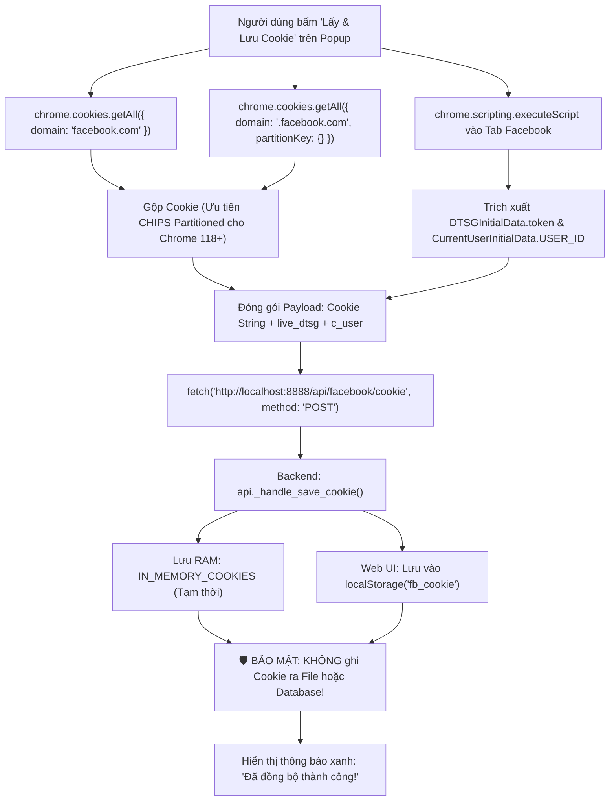

# MODULE 4: CHROME EXTENSION (PROXIFY BRIDGE EXTENSION)

> [!NOTE]
> Thuộc bộ cẩm nang chi tiết mã nguồn Proxify v2.0 Architecture Deep-Dive.  
> [⬅️ Quay lại Module 3: Nền Tảng Facebook](./03_facebook_platform.md) | [Quay lại Cẩm nang tổng quan](../CODEBASE_DETAILED_GUIDE.md) | [Tiến tới Module 5: Plugin & Tổng Kết ➡️](./05_plugins_and_extensions.md)

---

## MỤC LỤC MODULE 4
- [4.1. `backend/chrome_extension/background.js` (Service Worker điều phối Tab & In-Tab Execution)](#41-backendchrome_extensionbackgroundjs)
  - [Lắng nghe WebRequest](#lắng-nghe-webrequest)
  - [Hàm `pollForBridgeJobs`](#hàm-async-function-pollforbridgejobs)
  - [Hàm `executeBridgeJob`](#hàm-async-function-executebridgejobjob)
- [4.2. `backend/chrome_extension/popup.js` (Quét Cookie & Trích xuất Token 1-chạm)](#42-backendchrome_extensionpopupjs)
- [📊 Lưu đồ 5: Đồng Bộ Cookie & Token 1-Chạm qua Extension Popup](#-lưu-đồ-5-đồng-bộ-cookie--token-1-chạm-qua-extension-popup)
- [4.3. `backend/chrome_extension/content.js` (Keepalive & Message Forwarder)](#43-backendchrome_extensioncontentjs)

---

<a id="41-backendchrome_extensionbackgroundjs"></a>
## 4.1. `backend/chrome_extension/background.js`
Service Worker của Chrome Extension theo chuẩn Manifest V3. Chịu trách nhiệm chặn bắt mẫu gói tin, duy trì kết nối với backend và tiêm mã thực thi vào Tab Facebook thật.

---

### Lắng nghe WebRequest
* **`chrome.webRequest.onBeforeRequest` & `onSendHeaders`**:
  * Lắng nghe các yêu cầu gửi đến `*://*.facebook.com/api/graphql/*`.
  * Gom `form_data` (body) và `requestHeaders` theo `requestId`.
  * Gửi mẫu bắt được về Backend qua `POST http://localhost:8888/api/facebook/bridge/template` để tự động học doc_id mới.

---

### Hàm `async function pollForBridgeJobs()`
* **Mục đích:** Vòng lặp thăm dò công việc liên tục mỗi 1 giây.
* **Logic:** Gửi `fetch("http://localhost:8888/api/facebook/bridge/jobs")`. Nếu có job trả về, gọi ngay `executeBridgeJob(job)`.

---

### Hàm `async function executeBridgeJob(job)`
* **Mục đích:** Thực hiện cào bài viết trực tiếp từ bên trong trình duyệt.
* **Logic chi tiết:**
  1. Tìm kiếm tab đang mở Facebook bằng `chrome.tabs.query`.
  2. Nếu job có chỉ định `target_group_url` và tab Facebook hiện tại chưa mở đúng nhóm, Extension tự động chuyển hướng tab tới nhóm đó và đợi 5 giây cho trang tải xong.
  3. **Thực thi In-Tab trong MAIN World:**
     ```javascript
     chrome.scripting.executeScript({
         target: { tabId: targetTab.id },
         world: "MAIN", // Chạy trực tiếp trong ngữ cảnh trang, không bị cô lập bởi Isolated World
         func: async (url, method, headers, body) => {
             // 1. Trích xuất token bảo mật live từ RAM của trang Facebook
             let liveDtsg = window.require?.("DTSGInitialData")?.token || "";
             // 2. Gửi lệnh fetch() nội bộ với cookie thật của trình duyệt
             const resp = await fetch(url, {
                 method: method,
                 headers: headers,
                 body: body,
                 credentials: "include" // Tự động đính kèm cookie HttpOnly
             });
             return await resp.text();
         }
     });
     ```
  4. **DOM Scraper Fallback:** Nếu GraphQL bị lỗi phân quyền (Error 1357001), hàm tự động chuyển sang bóc tách các thẻ `<div role="article">` trực tiếp từ HTML DOM của tab.
  5. Gửi dữ liệu trả về lên `POST http://localhost:8888/api/facebook/bridge/result`.

---

<a id="42-backendchrome_extensionpopupjs"></a>
## 4.2. `backend/chrome_extension/popup.js`
Giao diện điều khiển 1-chạm khi người dùng bấm vào biểu tượng tiện ích trên thanh công cụ Chrome.

* **Sự kiện click `getCookieBtn`:**
  1. Gọi `chrome.cookies.getAll({ domain: "facebook.com" })` và `chrome.cookies.getAll({ domain: ".facebook.com", partitionKey: {} })` để gom toàn bộ cookie (bao gồm cookie Partitioned CHIPS của Chrome mới).
  2. Inject script vào tab đang hoạt động để lấy `DTSGInitialData.token` và `CurrentUserInitialData.USER_ID`.
  3. Ghép chuỗi cookie đầy đủ (bắt buộc có `c_user` và `xs`).
  4. Gửi POST đến `http://localhost:8888/api/facebook/cookie` để đồng bộ ngay lập tức cho Backend.
  5. Hiển thị thông báo trạng thái xanh `Đã đồng bộ thành công!`.

---

<a id="diagram-5"></a>
### 📊 Lưu đồ 5: Đồng Bộ Cookie & Token 1-Chạm qua Extension Popup

#### 1. Sơ đồ dạng khối trực quan (Sắc nét, dễ nhìn trên mọi màn hình):
```
┌─────────────────────────────────────────────────────────────────────────────────┐
│              LUỒNG ĐỒNG BỘ COOKIE & TOKEN 1-CHẠM (EXTENSION POPUP)              │
│                                                                                 │
│   Người dùng mở tab Facebook & bấm nút "Lấy & Lưu Cookie" trên Popup             │
│        │                                                                        │
│        ├─► [1. Quét Cookie API đa miền]                                         │
│        │   chrome.cookies.getAll({ domain: "facebook.com" })                    │
│        │   chrome.cookies.getAll({ partitionKey: {} }) (Hỗ trợ CHIPS Chrome 118+)│
│        │                                                                        │
│        ├─► [2. Inject Script trích xuất Token Live từ RAM]                      │
│        │   window.require("DTSGInitialData").token ──► live_dtsg                │
│        │   CurrentUserInitialData.USER_ID          ──► c_user                   │
│        │                                                                        │
│        ▼                                                                        │
│   Ghép chuỗi Cookie & Payload JSON hoàn chỉnh                                   │
│        │                                                                        │
│        ▼ POST http://localhost:8888/api/facebook/cookie                         │
│   Backend: api._handle_save_cookie()                                            │
│        │                                                                        │
│        ├─► Lưu vào RAM: IN_MEMORY_COOKIES (Tạm thời) & Template GraphQL          │
│        ├─► Đồng bộ Web UI: Lưu trên localStorage (fb_cookie) để Extractor đọc    │
│        └─► BẢO MẬT: Tuyệt đối KHÔNG ghi cookie ra file đĩa hay Database!        │
│        │                                                                        │
│        ▼ Phản hồi thành công (200 OK)                                           │
│   Popup hiển thị thông báo trạng thái: "Đã đồng bộ thành công! 🟢"               │
└─────────────────────────────────────────────────────────────────────────────────┘
```

#### 2. Sơ đồ luồng Mermaid phân tầng từ trên xuống (Dạng dọc TD):


---

<a id="43-backendchrome_extensioncontentjs"></a>
## 4.3. `backend/chrome_extension/content.js`
Content Script được tiêm tự động vào mọi trang Facebook (`https://*.facebook.com/*`).

* **`setInterval(() => chrome.runtime.sendMessage({ type: "KEEPALIVE" }), 10000)`**:
  * Gửi tín hiệu nhịp tim mỗi 10 giây về Service Worker.
  * **Ý nghĩa:** Manifest V3 tự động tắt Service Worker sau 30 giây rảnh rỗi. Tín hiệu này đánh thức worker liên tục, bảo đảm vòng lặp `pollForBridgeJobs` không bao giờ bị gián đoạn khi người dùng đang mở tab Facebook.

---

> [!TIP]
> [⬅️ Quay lại Module 3: Nền Tảng Facebook](./03_facebook_platform.md) | [Quay lại Cẩm nang tổng quan](../CODEBASE_DETAILED_GUIDE.md) | [Tiến tới Module 5: Plugin & Tổng Kết ➡️](./05_plugins_and_extensions.md)
