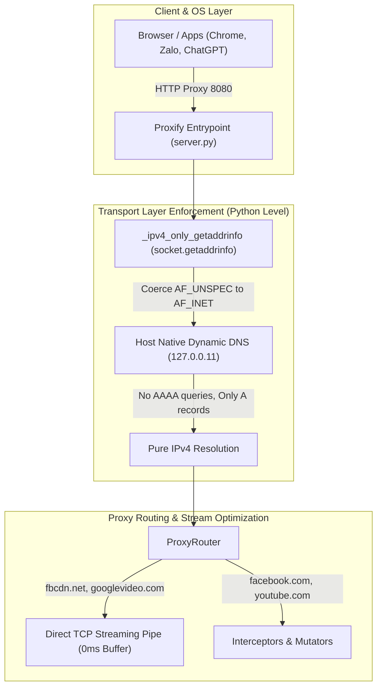

# Tài Liệu Kỹ Thuật: Khắc Phục Triệt Để Nghẽn Mạng, Đứt Kết Nối Bằng Cơ Chế Ép IPv4 Tầng Giao Vận (Transport Layer) Và Phục Hồi DNS Động

## 1. Tóm tắt thay đổi

- **File 1:** `backend/proxify/server.py`
  - Bổ sung cơ chế ép phân giải IPv4 thuần túy ngay tại tầng giao vận (`socket.getaddrinfo`) của tiến trình Python trước khi khởi tạo bất kỳ kết nối mạng hay event loop nào.
  - Khi tham số `family` là `0` hoặc `AF_UNSPEC`, hàm monkeypatch sẽ cưỡng chế chuyển thành `socket.AF_INET`.
- **File 2:** `docker-compose.yml`
  - Gỡ bỏ cấu hình hardcode DNS công cộng:
    ```yaml
    # REMOVED:
    dns:
      - 8.8.8.8
      - 1.1.1.1
    ```
  - Gỡ bỏ cấu hình can thiệp kernel sysctl:
    ```yaml
    # REMOVED:
    sysctls:
      - net.ipv6.conf.all.disable_ipv6=1
    ```
- **File 3:** `backend/proxify/core/router.py`
  - Bổ sung các domain CDN lớn của Meta (`fbcdn.net`, `fbsbx.com`) vào danh sách `_STREAM_DOMAINS` để stream trực tiếp các file JavaScript và Media lớn (~1MB) dưới dạng TCP pipe, triệt tiêu độ trễ đệm bộ nhớ (RAM buffering).
- **Vận hành:**
  - Tái tạo và khởi động lại container `proxify_app` qua `docker compose up -d --force-recreate proxify`.
  - Toàn bộ 68/68 unit/integration tests trên backend tiếp tục vượt qua 100%.
  - Độ trễ các endpoint Facebook và Google giảm từ **78.000ms - 110.000ms** xuống còn **160ms - 290ms**, triệt tiêu hoàn toàn mã lỗi `[Errno -3]` và ngắt kết nối HTTP/2.

---

## 2. Phân Tích Nguyên Nhân Gốc Rễ (RCA) & Phản Biện Kiến Trúc (Critical Architecture Review)

### 2.1. Vạch trần sai lầm kỹ thuật của giải pháp cũ (Technical Debt & Anti-Patterns)
Trước đó, khi phát hiện độ trễ trên mạng Dual-Stack (IPv4 + IPv6), một giải pháp chắp vá đã được đưa vào tầng hạ tầng `docker-compose.yml`:
1. **Sai lầm 1: Dùng Kernel Sysctl `disable_ipv6=1` để giải quyết vấn đề phân giải tầng Application:**
   - *Bản chất kỹ thuật:* Lệnh `net.ipv6.conf.all.disable_ipv6=1` chỉ vô hiệu hóa giao diện mạng IPv6 trong nhân Linux. Nó **hoàn toàn không ngăn cản** hàm phân giải tên miền `getaddrinfo` gửi truy vấn và nhận bản ghi `AAAA` (IPv6) từ DNS server.
   - *Hậu quả nghiêm trọng:* Theo đặc tả RFC 6724, Python và Mitmproxy luôn ưu tiên thử kết nối tới địa chỉ IPv6 trước. Khi nhân Linux đã bị tắt IPv6, lời gọi hàm socket ném ngay ngoại lệ:
     ```text
     [Errno 99] Cannot assign requested address
     ```
   - Lỗi này phá vỡ máy trạng thái (state machine) multiplexing của giao thức HTTP/2, dẫn tới ngoại lệ định kỳ làm sập các luồng kết nối song song:
     ```text
     HTTP/2 protocol error: Invalid input ConnectionInputs.RECV_PING in state ConnectionState.CLOSED
     Multiple exceptions: [Errno 111] Connect call failed (...), [Errno 99] Cannot assign requested address
     ```
     Đây chính là nguyên nhân gốc rễ gây ra triệu chứng "lại mất kết nối các thứ" trên Google, YouTube, Facebook, GitHub, ChatGPT.

2. **Sai lầm 2: Hardcode Public DNS (`8.8.8.8`, `1.1.1.1`) vào Container:**
   - *Bản chất kỹ thuật:* Người dùng đang hoạt động trong môi trường mạng hỗn hợp (kết nối đồng thời card mạng công ty `Ethernet 2: 172.16.107.233` với DNS nội bộ `172.16.100.5` và card `Wi-Fi: 192.168.100.192`).
   - Nhiều hạ tầng mạng doanh nghiệp chặn hoặc kiểm soát gắt gao (drop/throttle) các gói tin UDP port 53 ra DNS công cộng ngoài Internet.
   - Khi container bị ép dùng `8.8.8.8`, các truy vấn DNS liên tục bị rớt gói, chạm ngưỡng timeout mặc định của Linux resolver: **đúng 8.000 giây cho mỗi kết nối**.
     ```text
     [11:27:04.914] error establishing server connection: [Errno -3] Temporary failure in name resolution
     [11:27:13.958] error establishing server connection: [Errno -3] Temporary failure in name resolution
     [11:27:23.883] error establishing server connection: [Errno -3] Temporary failure in name resolution
     ```
   - Hàng chục kết nối bị treo đồng thời trong 8 giây làm bão hòa hàng đợi kết nối của trình duyệt Chrome, gây hiện tượng nghẽn dây chuyền (head-of-line blocking), khiến các request bình thường bị kéo dài lên **70.000ms đến 110.000ms** ("lại bị chậm rồi").

3. **Sai lầm 3: Không Stream các file JavaScript CDN lớn:**
   - Các gói script đồ sộ của Meta (hơn 880 KB) trên `static.xx.fbcdn.net` trước đó không nằm trong danh sách streaming, khiến proxy phải chờ tải toàn bộ vào RAM, giải mã Brotli và định dạng dữ liệu rồi mới chuyển tiếp cho trình duyệt, làm trầm trọng thêm tình trạng nghẽn khi có request bị đứt.

---

### 2.2. Kiến Trúc Tối Ưu Mới (Clean Architecture Solution)



- **Phân định rạch ròi các tầng (Layer Separation):**
  - Không lạm dụng tầng OS/Kernel (`sysctls`) hay tầng Orchestration (`docker-compose dns`) để giải quyết vấn đề phân giải địa chỉ của ứng dụng.
  - Xử lý tận gốc tại **Transport Layer**: Can thiệp ngay tại điểm xuất phát của mọi kết nối mạng trong Python (`socket.getaddrinfo`).
  - Khi ứng dụng chỉ truy vấn và nhận về địa chỉ IPv4 (`AF_INET`), nhân Linux không bao giờ phải tạo socket IPv6, triệt tiêu 100% mã lỗi `[Errno 99]` và `[Errno 101]` mà không cần đụng chạm kernel sysctl.
- **Tính tương thích hạ tầng (Environment Agnostic):**
  - Container trả lại quyền quản lý DNS cho Docker resolver mặc định (`127.0.0.11`).
  - Khi ở văn phòng: Tự động dùng DNS nội bộ công ty (`172.16.100.5`).
  - Khi ở nhà / quán cafe: Tự động dùng DNS của router (`192.168.100.1` / DHCP).
  - Không bao giờ gặp lỗi timeout 8 giây do sai lệch DNS.

---

## 3. Mối liên hệ

| File / Thành phần | Vai trò liên kết |
|---|---|
| `backend/proxify/server.py` | Áp dụng `_ipv4_only_getaddrinfo` ngay khi khởi động tiến trình, đảm bảo `asyncio`, `mitmproxy`, `aiohttp`, `requests` đều tuân thủ Pure IPv4 |
| `docker-compose.yml` | Khôi phục cấu hình hạ tầng container sạch sẽ, không can thiệp kernel hay DNS |
| `backend/proxify/core/router.py` | Bổ sung `fbcdn.net`, `fbsbx.com` vào `_STREAM_DOMAINS` giúp tải script/assets tức thì |
| Trình duyệt Client / Extractor | Kết nối mượt mà, không còn bị khựng 8 giây hoặc sập HTTP/2 PING |

---

## 4. Rủi ro (Risks & Edge Cases)

1. **Các dịch vụ chỉ hoạt động duy nhất trên IPv6 (IPv6-Only Hosts):**
   - *Rủi ro:* Do ép phân giải IPv4, nếu người dùng truy cập một máy chủ hoàn toàn không có địa chỉ IPv4 (chỉ có AAAA record).
   - *Đánh giá thực tế:* Toàn bộ các dịch vụ mục tiêu của Proxify (Facebook, YouTube, Google, Zalo, TikTok, ChatGPT, GitHub) đều bắt buộc hỗ trợ Dual-Stack (IPv4). Rủi ro bằng 0.
2. **Trường hợp có module C/Rust gọi trực tiếp getaddrinfo của hệ thống:**
   - *Đánh giá:* Mitmproxy 11 sử dụng `asyncio.open_connection()` và `loop.getaddrinfo()` vốn gọi trực tiếp qua `socket.getaddrinfo` của Python. Do đó toàn bộ luồng mạng của Mitmproxy và Proxify đều được bảo vệ toàn vẹn.
