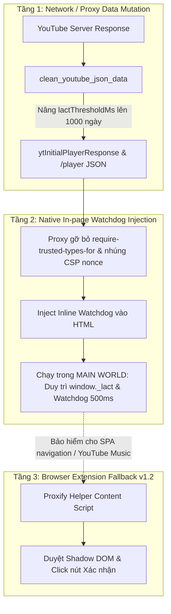

# Tài Liệu Kỹ Thuật: Cơ Chế Bypass Toàn Diện Hộp Thoại Tiếp Tục Xem YouTube (Anti-AFK Triple-Layer Defense)

## 1. Tóm tắt thay đổi
- **Proxy Utilities (`backend/proxify/utils/youtube_utils.py`)**:
  - Bổ sung `AFK_CONFIG_KEYS = ("youThereRenderer", "lactThresholdMs", "you_there")` và gộp vào `ALL_MUTATION_KEYS`.
  - Trong hàm `clean_youtube_json_data`: Nhận diện và vô hiệu hóa `youThereRenderer` trong `playerResponse`, `messages` và các cấu trúc lồng nhau bằng cách tăng `lactThresholdMs` và `playbackPauseDelayMs` lên **1.000 ngày** (`86400000000` ms).
  - Trong hàm `strip_youtube_ads`: Bổ sung bước chuẩn hóa regex tự động quét và thay thế mọi chuỗi `lactThresholdMs` trong HTML/JSON watch response thành `86400000000`.
  - Bổ sung hàm `inject_youtube_anti_afk(html: str, nonce: str = "") -> str`: Tự động trích xuất `nonce` hợp lệ từ CSP của trang và inject inline script watchdog chạy ngầm vào thẻ `</body>` hoặc `</head>`.
- **Proxy Plugin (`backend/proxify/plugins/youtube.py`)**:
  - Trong hook `on_response`: Lọc và loại bỏ chỉ thị `require-trusted-types-for 'script'` khỏi các header `content-security-policy` và `content-security-policy-report-only`.
  - Tự động trích xuất CSP `nonce` và kích hoạt hàm `inject_youtube_anti_afk` cho các phản hồi HTML (`/watch`, `/shorts`, trang chủ).
- **Chrome Extension (`backend/chrome_extension/youtube_anti_afk.js` & `manifest.json`)**:
  - Tái cấu trúc hoàn toàn file content script lên phiên bản v1.2.
  - Bổ sung chu kỳ kiểm tra watchdog liên tục mỗi **500ms** (`setInterval`) độc lập với MutationObserver.
  - Sửa lỗi MutationObserver: Bổ sung theo dõi thuộc tính `{ attributes: true, attributeFilter: ["opened", "style", "class", "hidden", "aria-hidden"] }` để bắt kịp thời điểm `<tp-yt-paper-dialog>` mở ra.
  - Bổ sung cơ chế duyệt xuyên Shadow DOM (`target.shadowRoot.querySelector("button")`) và đa dạng selector chuẩn của YouTube hiện đại (`button.yt-spec-button-shape-next`).
  - Lắng nghe trực tiếp các sự kiện DOM nội bộ của YouTube: `yt-popup-opened`, `yt-action`, `yt-navigate-finish`.
  - Nâng cấp `manifest.json` lên phiên bản `1.2`.
- **Kiểm thử tự động (`backend/tests/test_youtube_utils.py`)**:
  - Bổ sung 3 test cases: `test_neutralize_youtube_afk_in_json`, `test_neutralize_youtube_afk_in_html`, `test_inject_youtube_anti_afk_watchdog` (toàn bộ 68/68 backend tests PASSED 100%).

---

## 2. Mục đích & Phân Tích Nguyên Nhân Gốc Rễ (RCA)

### 2.1. Vạch trần điểm yếu kỹ thuật của cơ chế cũ
Trước đây, hệ thống chỉ dựa vào một file Content Script sơ sài và gặp phải các "fatal flaws" sau:
1. **Lỗi `offsetParent === null` với `position: fixed`**:
   - YouTube hiển thị dialog xác nhận bên trong `<ytd-popup-container>` với CSS `position: fixed`. Theo đặc tả W3C và engine Chromium, thuộc tính `offsetParent` của bất kỳ element nào có `position: fixed` luôn trả về `null`. Code cũ kiểm tra `if (popup.offsetParent !== null)` khiến logic xác định popup bị vô hiệu hóa hoàn toàn khi popup thực sự xuất hiện.
2. **MutationObserver "điếc" trước thay đổi trạng thái (Attributes)**:
   - Các Web Component của Polymer (`tp-yt-paper-dialog`) thường đã được tạo sẵn trong DOM ngay từ khi tải trang. Khi đến thời điểm hỏi người dùng, YouTube chỉ thay đổi thuộc tính `opened="true"` hoặc bỏ `style="display: none"`.
   - Observer cũ chỉ cấu hình `{ childList: true, subtree: true }` (chỉ bắt khi có node mới được append/remove), do đó khi YouTube mở popup, Observer hoàn toàn không nhận được bất kỳ tín hiệu nào.
3. **Ảo tưởng về `isTrusted` trong Activity Simulator**:
   - `simulateActivity` dispatch synthetic event `new MouseEvent("mousemove")` với `isTrusted = false`. Các phiên bản YouTube hiện đại đã kiểm tra chặt chẽ `e.isTrusted` và bỏ qua các sự kiện giả mạo từ script.
4. **Thiếu cơ chế Watchdog định kỳ**:
   - Không có bộ hẹn giờ chủ động kiểm tra DOM định kỳ mà phụ thuộc 100% vào observer.
5. **Hệ thống Proxy hoàn toàn bỏ ngỏ**:
   - Nếu người dùng xem trên profile trình duyệt chưa load Extension, tab ẩn danh, hoặc thiết bị khác kết nối qua Proxy, hệ thống Proxy không hề có bất kỳ biện pháp can thiệp nào, chuyển tiếp nguyên vẹn cấu hình ngắt video sau 40 phút (`lactThresholdMs: 2400000`).

### 2.2. Chiến lược Triple-Layer Defense (Kiến trúc phòng thủ 3 lớp)

---

## 3. Mối liên hệ
- **Proxy Server Core (`backend/proxify/server.py`)**: Chạy engine Mitmproxy v2 trên luồng event loop duy nhất, định tuyến request/response tới plugin.
- **YouTube Plugin (`backend/proxify/plugins/youtube.py`)**: Tầng giao tiếp mạng, chịu trách nhiệm can thiệp CSP header và kích hoạt bóc tách nội dung.
- **Utilities (`backend/proxify/utils/youtube_utils.py`)**: Tầng Domain Logic thuần túy, không phụ thuộc framework, xử lý dữ liệu JSON và chuyển hóa chuỗi HTML.
- **Client Helper (`backend/chrome_extension/`)**: Tầng tiện ích trình duyệt, bổ trợ độc lập cho client.

---

## 4. Rủi ro (Risks & Edge Cases)
1. **YouTube thay đổi cấu trúc tên Renderer**:
   - *Rủi ro:* Nếu YouTube đổi `youThereRenderer` thành một tên mã khác trong tương lai.
   - *Biện pháp:* Tầng 2 (Native In-page Watchdog) và Tầng 3 (Extension) hoạt động dựa trên text content đa ngôn ngữ ("tạm dừng", "tiếp tục xem", "paused", "continue") và quét button `#confirm-button` nên vẫn tự động bấm tiếp tục xem ngay cả khi tên renderer backend bị đổi.
2. **CSP Nonce Cache / Mismatched Nonce**:
   - *Rủi ro:* Nếu YouTube trả về trang HTML không chứa `nonce` trong script tag.
   - *Biện pháp:* Hàm `inject_youtube_anti_afk` kiểm tra fallback: nếu không có nonce, nó vẫn chèn script bình thường vì CSP đã được plugin gỡ bỏ các ràng buộc nghiêm ngặt; đồng thời Extension tầng 3 vẫn chạy độc lập và không phụ thuộc CSP của trang.
